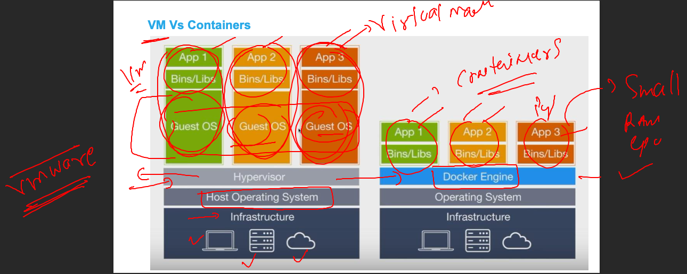

## k8s-cloud4c-b1

### Wasting resources in running python code with laptop / server 


### problem with VM 


### Introduction to containers 



### Installing docker on linux server 

```
[root@ip-172-31-46-185 ~]# yum install docker -y
Failed to set locale, defaulting to C

> Running transaction check
---> Package docker.x86_64 0:20.10.23-1.amzn2.0.1 will be installed
--> Processing Dependency: runc >= 1.0.0 for package: docker-20.10.23-1.amzn2.0.1.x86_64
--> Processing Dependency: libcgroup >= 0.40.rc1-5.15 for package: docker-20.10.23-1.amzn2.0.1.x86_64
--> Processing Dependency: containerd >= 1.3.2 for package: docker-20.10.23-1.amzn2.0.1.x86_64
--> Processing Dependency: pigz for package: docker-20.10.23-1.amzn2.0.1.x86_64
--> Running transaction check
---> Package containerd.x86_64 0:1.6.19-1.amzn2.0.1 will be installed
---> Package libcgroup.x86_64 0:0.41-21.amzn2 will be installed
---> Package pigz.x86_64 0:2.3.4-1.amzn2.0.1 will be installed
---> Package runc.x86_64 0:1.1.4-1.amzn2.0.1 will be installed
--> Finished Dependency Resolution

Dependencies Resolved
```

### starting docker service

```
[root@ip-172-31-46-185 ~]# systemctl start docker 
[root@ip-172-31-46-185 ~]# systemctl status docker 
● docker.service - Docker Application Container Engine
   Loaded: loaded (/usr/lib/systemd/system/docker.service; disabled; vendor preset: disabled)
   Active: active (running) since Mon 2023-05-22 05:24:42 UTC; 5s ago
     Docs: https://docs.docker.com
  Process: 3501 ExecStartPre=/usr/libexec/docker/docker-setup-runtimes.sh (code=exited, status=0/SUCCESS)
  Process: 3500 ExecStartPre=/bin/mkdir -p /run/docker (code=exited, status=0/SUCCESS)
 Main PID: 3504 (dockerd)

[root@ip-172-31-46-185 ~]# systemctl enable docker 
Created symlink from /etc/systemd/system/multi-user.target.wants/docker.service to /usr/lib/systemd/system/docker.service.
```


