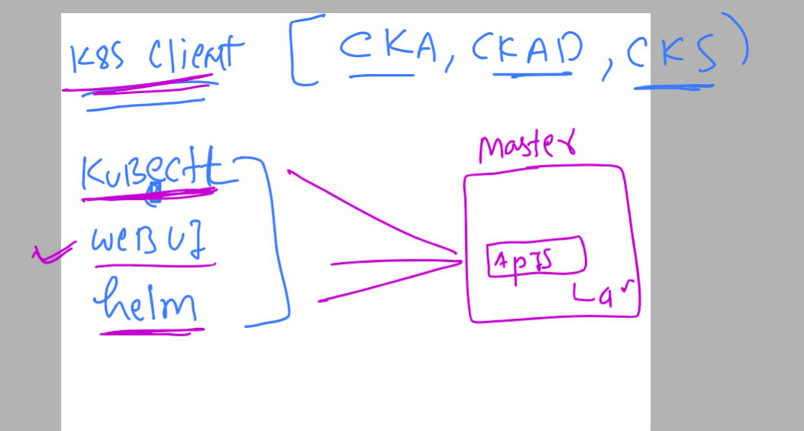

# k8s-cloud4c-b1

###  checking lab connection and cleaning up namespace data

```
[ec2-user@ip-172-31-35-0 ashu-codes]$ kubectl config get-contexts 
CURRENT   NAME                          CLUSTER      AUTHINFO           NAMESPACE
*         kubernetes-admin@kubernetes   kubernetes   kubernetes-admin   ashu-app
[ec2-user@ip-172-31-35-0 ashu-codes]$ 
[ec2-user@ip-172-31-35-0 ashu-codes]$ kubectl  get all
NAME                           READY   STATUS    RESTARTS      AGE
pod/ashu-d1-7f4797f6b7-25wr9   1/1     Running   1 (14m ago)   2d23h
pod/ashu-d1-7f4797f6b7-kcsbw   1/1     Running   1 (14m ago)   2d23h
pod/ashu-d1-7f4797f6b7-q7g2t   1/1     Running   1 (14m ago)   2d23h

NAME              TYPE       CLUSTER-IP      EXTERNAL-IP   PORT(S)        AGE
service/ashulb3   NodePort   10.103.142.41   <none>        80:30790/TCP   2d23h

NAME                      READY   UP-TO-DATE   AVAILABLE   AGE
deployment.apps/ashu-d1   3/3     3            3           2d23h

NAME                                 DESIRED   CURRENT   READY   AGE
replicaset.apps/ashu-d1-7f4797f6b7   3         3         3       2d23h
[ec2-user@ip-172-31-35-0 ashu-codes]$ kubectl delete all --all
pod "ashu-d1-7f4797f6b7-25wr9" deleted
pod "ashu-d1-7f4797f6b7-kcsbw" deleted
pod "ashu-d1-7f4797f6b7-q7g2t" deleted
service "ashulb3" deleted
deployment.apps "ashu-d1" deleted
```

### Verify control plane api-server port

```
[ec2-user@ip-172-31-35-0 ashu-codes]$ kubectl  cluster-info 
Kubernetes control plane is running at https://172.31.11.234:6443
CoreDNS is running at https://172.31.11.234:6443/api/v1/namespaces/kube-system/services/kube-dns:dns/proxy

```

### More detail info about k8s internal component running status 

```
[ec2-user@ip-172-31-35-0 ashu-codes]$ kubectl  get  pods -n  kube-system 
NAME                                                                   READY   STATUS    RESTARTS       AGE
calico-kube-controllers-57b57c56f-b6bsm                                1/1     Running   12 (32m ago)   17d
calico-node-c7vgt                                                      1/1     Running   12 (32m ago)   17d
calico-node-f7pvc                                                      1/1     Running   12 (32m ago)   17d
calico-node-g2lpj                                                      1/1     Running   12 (32m ago)   17d
calico-node-jzm4b                                                      1/1     Running   12 (32m ago)   17d
calico-node-lk7n8                                                      1/1     Running   12 (32m ago)   17d
coredns-787d4945fb-2mtqx                                               1/1     Running   12 (32m ago)   17d
coredns-787d4945fb-5mtsw                                               1/1     Running   12 (32m ago)   17d
etcd-ip-172-31-11-234.ap-south-1.compute.internal                      1/1     Running   12 (32m ago)   17d
kube-apiserver-ip-172-31-11-234.ap-south-1.compute.internal            1/1     Running   12 (32m ago)   17d
kube-controller-manager-ip-172-31-11-234.ap-south-1.compute.internal   1/1     Running   12 (32m ago)   17d
kube-proxy-9jkcn                                                       1/1     Running   12 (32m ago)   17d
kube-proxy-gnkcg                                                       1/1     Running   12 (32m ago)   17d
kube-proxy-hghb9                                                       1/1     Running   12 (32m ago)   17d
kube-proxy-sbm6f                                                       1/1     Running   12 (32m ago)   17d
kube-proxy-zhkfk                                                       1/1     Running   12 (32m ago)   17d
kube-scheduler-ip-172-31-11-234.ap-south-1.compute.internal            1/1     Running   12 (32m ago)   17d
```

## more options for k8s clients to connect control plane 



### K8s dashboard deploy

```
[ec2-user@ip-172-31-35-0 ashu-codes]$ kubectl apply -f https://raw.githubusercontent.com/kubernetes/dashboard/v2.7.0/aio/deploy/recommended.yaml
namespace/kubernetes-dashboard created
serviceaccount/kubernetes-dashboard created
service/kubernetes-dashboard created
secret/kubernetes-dashboard-certs created
secret/kubernetes-dashboard-csrf created
secret/kubernetes-dashboard-key-holder created
configmap/kubernetes-dashboard-settings created
role.rbac.authorization.k8s.io/kubernetes-dashboard created
clusterrole.rbac.authorization.k8s.io/kubernetes-dashboard created
rolebinding.rbac.authorization.k8s.io/kubernetes-dashboard created
clusterrolebinding.rbac.authorization.k8s.io/kubernetes-dashboard created
deployment.apps/kubernetes-dashboard created
service/dashboard-metrics-scraper created
deployment.apps/dashboard-metrics-scraper created
[ec2-user@ip-172-31-35-0 ashu-codes]$ 
```

### lets verify that 

```
[ec2-user@ip-172-31-35-0 ashu-codes]$ kubectl  get   deploy  -n kubernetes-dashboard  
NAME                        READY   UP-TO-DATE   AVAILABLE   AGE
dashboard-metrics-scraper   1/1     1            1           96s
kubernetes-dashboard        1/1     1            1           96s
[ec2-user@ip-172-31-35-0 ashu-codes]$ 
[ec2-user@ip-172-31-35-0 ashu-codes]$ kubectl  get  pod  -n kubernetes-dashboard  
NAME                                        READY   STATUS    RESTARTS   AGE
dashboard-metrics-scraper-7bc864c59-njnfr   1/1     Running   0          2m
kubernetes-dashboard-6c7ccbcf87-78dsr       1/1     Running   0          2m
[ec2-user@ip-172-31-35-0 ashu-codes]$ 
[ec2-user@ip-172-31-35-0 ashu-codes]$ kubectl  get  svc   -n kubernetes-dashboard  
NAME                        TYPE        CLUSTER-IP       EXTERNAL-IP   PORT(S)    AGE
dashboard-metrics-scraper   ClusterIP   10.102.225.253   <none>        8000/TCP   2m15s
kubernetes-dashboard        ClusterIP   10.110.130.52    <none>        443/TCP    2m15s
```

### chaning a running svc to NodePOrt or Loadbalancer from ClusterIP 

```
[ec2-user@ip-172-31-35-0 ashu-codes]$ kubectl  -n kubernetes-dashboard   edit   svc  kubernetes-dashboard 
service/kubernetes-dashboard edited
[ec2-user@ip-172-31-35-0 ashu-codes]$ kubectl  -n kubernetes-dashboard   get  svc 
NAME                        TYPE        CLUSTER-IP       EXTERNAL-IP   PORT(S)         AGE
dashboard-metrics-scraper   ClusterIP   10.102.225.253   <none>        8000/TCP        8m15s
kubernetes-dashboard        NodePort    10.110.130.52    <none>        443:31080/TCP   8m15s
[ec2-user@ip-172-31-35-0 ashu-codes]$ 

```
### lets access dashboard -- using https protocol 

### to access dashboard we need serviceaccount token which is not there by default 

### creating serviceaccount token for k8s-dasbhoard namespace

```
[ec2-user@ip-172-31-35-0 ashu-codes]$ kubectl -n kubernetes-dashboard   get  serviceaccount 
NAME                   SECRETS   AGE
default                0         12m
kubernetes-dashboard   0         12m
[ec2-user@ip-172-31-35-0 ashu-codes]$ 
[ec2-user@ip-172-31-35-0 ashu-codes]$ kubectl -n kubernetes-dashboard   get  secret 
NAME                              TYPE     DATA   AGE
kubernetes-dashboard-certs        Opaque   0      13m
kubernetes-dashboard-csrf         Opaque   1      13m
kubernetes-dashboard-key-holder   Opaque   2      13m
[ec2-user@ip-172-31-35-0 ashu-codes]$ 
[ec2-user@ip-172-31-35-0 ashu-codes]$ 
[ec2-user@ip-172-31-35-0 ashu-codes]$ kubectl -n  kubernetes-dashboard  create token  kubernetes-dashboard 
eyJhbGciOiJSUzI1NiIsImtpZCI6ImdXYmZjTm4tOHQ0Mi1FaHowcG1YanVYTko3S1NIVFhWRmRUcU40QWVTdDgifQ.eyJhdWQiOlsiaHR0cHM6Ly9rdWJlcm5ldGVzLmRlZmF1bHQuc3ZjLmNsdXN0ZXIubG9jYWwiXSwiZXhwIjoxNjg1OTQyNDA0LCJpYXQiOjE2ODU5Mzg4MDQsImlzcyI6Imh0dHBzOi8va3ViZXJuZXRlcy5kZWZhdWx0LnN2Yy5jbHVzdGVyLmxvY2FsIiwia3ViZXJu
```

### giving full permission to serviceaccount 

```
[ec2-user@ip-172-31-35-0 ashu-codes]$ kubectl create clusterrolebinding  power --clusterrole=cluster-admin --serviceaccount=kubernetes-dashboard:kubernetes-dashboard 
clusterrolebinding.rbac.authorization.k8s.io/power created
[ec2-user@ip-172-31-35-0 ashu-codes]$ 
```

