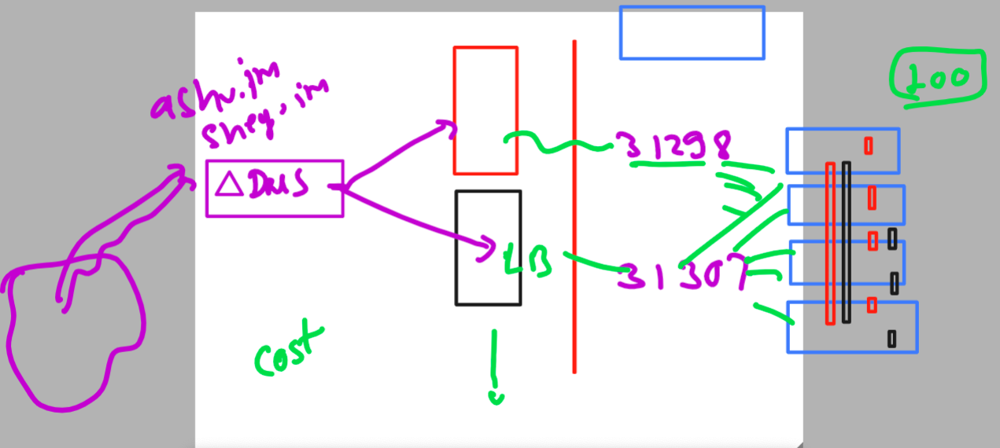
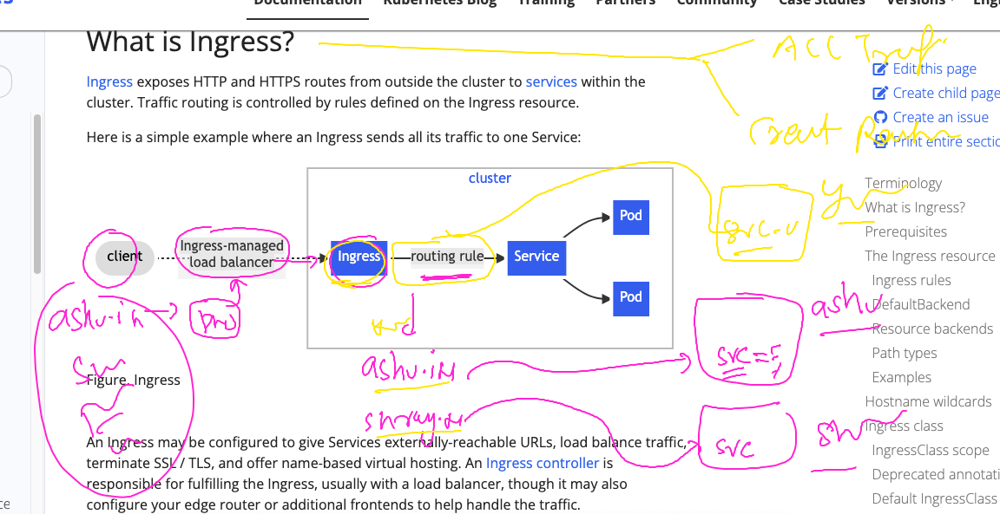

# k8s-cloud4c-b1

### hosting app using domain name need many loadbalancer externally which is leading to huge cost 



## Introduction to Ingress controller 



### to use Ingress controller we need to have your app running in k8s 

### creating java webapp in our namespaces using deployment controller 

```
 kubectl  create  deployment ashu-java-webapp --image=dockerashu/javaweb:v1 --port 8080 --dry-run=client -o yaml  >javaweb_deploy.yaml 
```

### creating 

```
[ec2-user@ip-172-31-35-0 k8s-app-deployment]$ kubectl  apply -f javaweb_deploy.yaml 
deployment.apps/ashu-java-webapp created
[ec2-user@ip-172-31-35-0 k8s-app-deployment]$ kubectl  get deploy 
NAME               READY   UP-TO-DATE   AVAILABLE   AGE
ashu-java-webapp   1/1     1            1           7s
[ec2-user@ip-172-31-35-0 k8s-app-deployment]$ kubectl  get rs
NAME                         DESIRED   CURRENT   READY   AGE
ashu-java-webapp-cf7d84459   1         1         1       10s
[ec2-user@ip-172-31-35-0 k8s-app-deployment]$ kubectl  get  po 
NAME                               READY   STATUS    RESTARTS   AGE
ashu-java-webapp-cf7d84459-fm8x6   1/1     Running   0          13s
[ec2-user@ip-172-31-35-0 k8s-app-deployment]$ 


```

