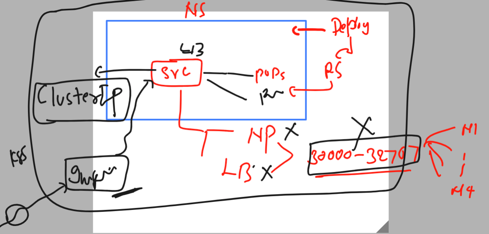
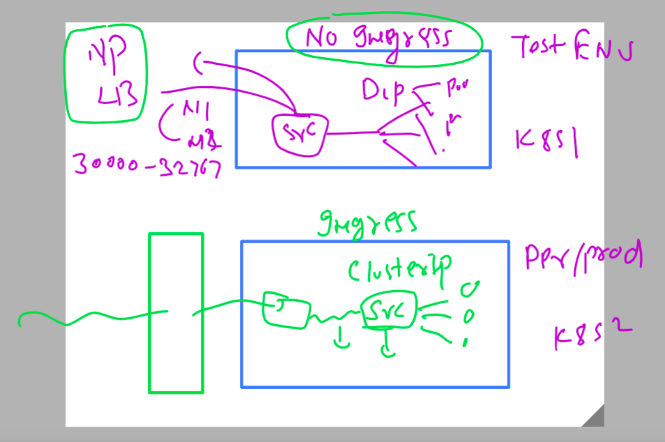

# k8s-cloud4c-b1

### hosting app using domain name need many loadbalancer externally which is leading to huge cost 


## Introduction to Ingress controller 


### to use Ingress controller we need to have your app running in k8s 

### creating java webapp in our namespaces using deployment controller 

```
 kubectl  create  deployment ashu-java-webapp --image=dockerashu/javaweb:v1 --port 8080 --dry-run=client -o yaml  >javaweb_deploy.yaml 
```

### creating 

```
[ec2-user@ip-172-31-35-0 k8s-app-deployment]$ kubectl  apply -f javaweb_deploy.yaml 
deployment.apps/ashu-java-webapp created
[ec2-user@ip-172-31-35-0 k8s-app-deployment]$ kubectl  get deploy 
NAME               READY   UP-TO-DATE   AVAILABLE   AGE
ashu-java-webapp   1/1     1            1           7s
[ec2-user@ip-172-31-35-0 k8s-app-deployment]$ kubectl  get rs
NAME                         DESIRED   CURRENT   READY   AGE
ashu-java-webapp-cf7d84459   1         1         1       10s
[ec2-user@ip-172-31-35-0 k8s-app-deployment]$ kubectl  get  po 
NAME                               READY   STATUS    RESTARTS   AGE
ashu-java-webapp-cf7d84459-fm8x6   1/1     Running   0          13s
[ec2-user@ip-172-31-35-0 k8s-app-deployment]$ 


```

### understanding ClusterIP service in k8s 



### selection  of service type with and without ingress controller



### creating cluster IP type service using expose 

```
[ec2-user@ip-172-31-35-0 k8s-app-deployment]$ kubectl  get deploy 
NAME               READY   UP-TO-DATE   AVAILABLE   AGE
ashu-java-webapp   1/1     1            1           13m
[ec2-user@ip-172-31-35-0 k8s-app-deployment]$ 

[ec2-user@ip-172-31-35-0 k8s-app-deployment]$ kubectl  expose  deploy ashu-java-webapp --type ClusterIP --port 8080 --name as
hulb67  --dry-run=client -o yaml  >javaclusteripsvc.yaml 
[ec2-user@ip-172-31-35-0 k8s-app-deployment]$ kubectl  apply -f javaclusteripsvc.yaml 
service/ashulb67 created
[ec2-user@ip-172-31-35-0 k8s-app-deployment]$ kubectl  get  svc
NAME       TYPE        CLUSTER-IP       EXTERNAL-IP   PORT(S)    AGE
ashulb67   ClusterIP   10.102.102.164   <none>        8080/TCP   4s
[ec2-user@ip-172-31-35-0 k8s-app-deployment]$ 

```

### ingress controller installation 

```
[ec2-user@ip-172-31-35-0 k8s-app-deployment]$ kubectl apply -f https://raw.githubusercontent.com/kubernetes/ingress-nginx/main/deploy/static/provider/baremetal/deploy.yaml
namespace/ingress-nginx created
serviceaccount/ingress-nginx created
serviceaccount/ingress-nginx-admission created
role.rbac.authorization.k8s.io/ingress-nginx created
role.rbac.authorization.k8s.io/ingress-nginx-admission created
clusterrole.rbac.authorization.k8s.io/ingress-nginx created
clusterrole.rbac.authorization.k8s.io/ingress-nginx-admission created
rolebinding.rbac.authorization.k8s.io/ingress-nginx created
rolebinding.rbac.authorization.k8s.io/ingress-nginx-admission created
clusterrolebinding.rbac.authorization.k8s.io/ingress-nginx created
```

### verify installation 

```

[ec2-user@ip-172-31-35-0 k8s-app-deployment]$ kubectl  -n  ingress-nginx  get  deploy 
NAME                       READY   UP-TO-DATE   AVAILABLE   AGE
ingress-nginx-controller   1/1     1            1           110s
[ec2-user@ip-172-31-35-0 k8s-app-deployment]$ 
[ec2-user@ip-172-31-35-0 k8s-app-deployment]$ kubectl  -n  ingress-nginx  get  pod
NAME                                        READY   STATUS      RESTARTS   AGE
ingress-nginx-admission-create-gw6vp        0/1     Completed   0          118s
ingress-nginx-admission-patch-fjdk6         0/1     Completed   1          118s
ingress-nginx-controller-7c8b876764-xlphw   1/1     Running     0          118s
[ec2-user@ip-172-31-35-0 k8s-app-deployment]$ kubectl  -n  ingress-nginx  get  svc
NAME                                 TYPE        CLUSTER-IP       EXTERNAL-IP   PORT(S)                      AGE
ingress-nginx-controller             NodePort    10.106.129.113   <none>        80:31607/TCP,443:31470/TCP   2m7s
ingress-nginx-controller-admission   ClusterIP   10.102.161.103   <none>        443/TCP                      2m7s
[ec2-user@ip-172-31-35-0 k8s-app-deployment]$ 
```

### ingress routing rule yaml 

```
apiVersion: networking.k8s.io/v1
kind: Ingress
metadata:
  name: ashu-app-route-rule # name of my routing rule 
  annotations:
    nginx.ingress.kubernetes.io/rewrite-target: /
spec:
  ingressClassName: nginx # name of class 
  rules: # lets write rule here 
  - host: hello.ashutoshh.in # capture traffice for this domain URL 
    http:
      paths:
      - path: /  # app path inside container (default location)
        pathType: Prefix
        backend:
          service:
            name: ashulb67
            port:
              number: 8080
```

### deploy it 

```
[ec2-user@ip-172-31-35-0 k8s-app-deployment]$ kubectl  apply -f ashu-ingress-routing-rule.yaml 
ingress.networking.k8s.io/ashu-app-route-rule created
[ec2-user@ip-172-31-35-0 k8s-app-deployment]$ kubectl   get  ingress
NAME                  CLASS   HOSTS                ADDRESS   PORTS   AGE
ashu-app-route-rule   nginx   hello.ashutoshh.in             80      4s
[ec2-user@ip-172-31-35-0 k8s-app-deployment]$ 
```


