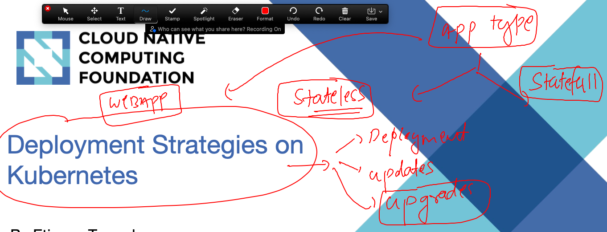
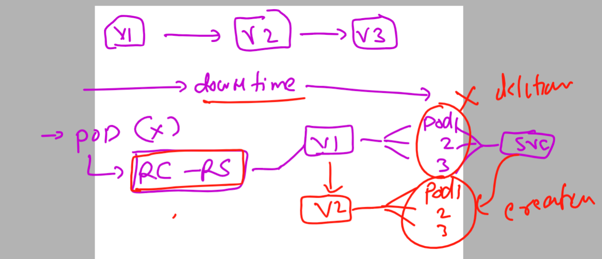
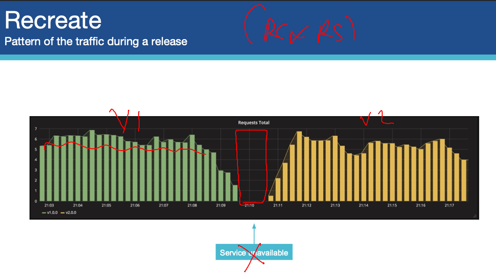
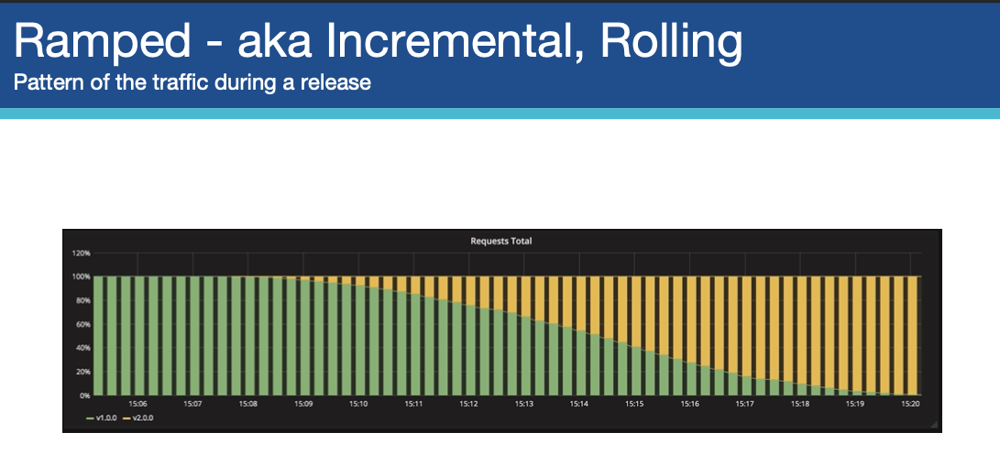

# k8s-cloud4c-b1

### APp deployment strategy in k8s -- for stateless and statefull applications 



### problem with app upgrade by using RC & RS 



### Recreate Deployment strategy 



### Default deployment strategy by Deployment controller is RAMped (rolling updates)



### cleaning up namespace

```
[ec2-user@ip-172-31-35-0 ashu-codes]$ kubectl config get-contexts 
CURRENT   NAME                          CLUSTER      AUTHINFO           NAMESPACE
*         kubernetes-admin@kubernetes   kubernetes   kubernetes-admin   ashu-app
[ec2-user@ip-172-31-35-0 ashu-codes]$ kubectl get all
NAME                                   READY   STATUS    RESTARTS      AGE
pod/ashu-java-webapp-cf7d84459-fm8x6   1/1     Running   1 (33m ago)   23h

NAME               TYPE        CLUSTER-IP       EXTERNAL-IP   PORT(S)    AGE
service/ashulb67   ClusterIP   10.102.102.164   <none>        8080/TCP   23h

NAME                               READY   UP-TO-DATE   AVAILABLE   AGE
deployment.apps/ashu-java-webapp   1/1     1            1           23h

NAME                                         DESIRED   CURRENT   READY   AGE
replicaset.apps/ashu-java-webapp-cf7d84459   1         1         1       23h
[ec2-user@ip-172-31-35-0 ashu-codes]$ kubectl  delete all --all
pod "ashu-java-webapp-cf7d84459-fm8x6" deleted
service "ashulb67" deleted
deployment.apps "ashu-java-webapp" deleted
[ec2-user@ip-172-31-35-0 ashu-codes]$ kubectl  get  ingress
NAME                  CLASS   HOSTS                ADDRESS       PORTS   AGE
ashu-app-route-rule   nginx   hello.ashutoshh.in   172.31.0.78   80      23h
[ec2-user@ip-172-31-35-0 ashu-codes]$ kubectl  delete ingress ashu-app-route-rule
ingress.networking.k8s.io "ashu-app-route-rule" deleted
[ec2-user@ip-172-31-35-0 ashu-codes]$ 
```


