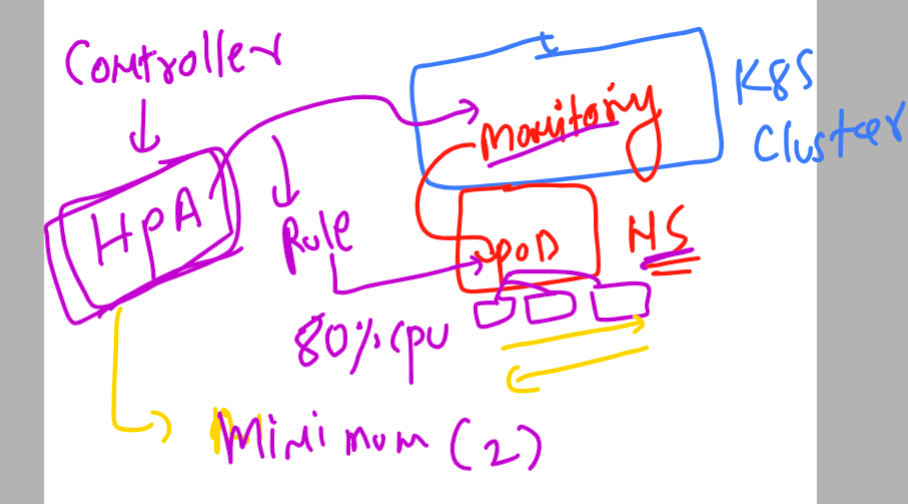

# k8s-cloud4c-b1

### pod scaling concept 


### introducing Resource limiting in single pod for vertical scaling -- by Control groups 


## tips 

### create new context and switching between 

```
[ec2-user@ip-172-31-35-0 ashu-codes]$ kubectl config get-contexts 
CURRENT   NAME                          CLUSTER      AUTHINFO           NAMESPACE
*         kubernetes-admin@kubernetes   kubernetes   kubernetes-admin   ashu-app
[ec2-user@ip-172-31-35-0 ashu-codes]$ 
[ec2-user@ip-172-31-35-0 ashu-codes]$ kubectl config set-context mytasks --cluster kubernetes --namespace tasks
Context "mytasks" created.
[ec2-user@ip-172-31-35-0 ashu-codes]$ 
[ec2-user@ip-172-31-35-0 ashu-codes]$ kubectl config get-contexts 
CURRENT   NAME                          CLUSTER      AUTHINFO           NAMESPACE
*         kubernetes-admin@kubernetes   kubernetes   kubernetes-admin   ashu-app
          mytasks                       kubernetes                      tasks
[ec2-user@ip-172-31-35-0 ashu-codes]$ kubectl config use-context mytasks 
Switched to context "mytasks".
[ec2-user@ip-172-31-35-0 ashu-codes]$ kubectl config get-contexts 
CURRENT   NAME                          CLUSTER      AUTHINFO           NAMESPACE
          kubernetes-admin@kubernetes   kubernetes   kubernetes-admin   ashu-app
*         mytasks                       kubernetes                      tasks
[ec2-user@ip-172-31-35-0 ashu-codes]$ 

```

### Cgroups demo with alpine pod 

```
apiVersion: v1
kind: Pod
metadata:
  creationTimestamp: null
  labels:
    run: ashutaskpod
  name: ashutaskpod
  namespace: tasks # we are defining namespace
spec:
  containers:
  - image: alpine
    name: ashutaskpod
    command: ['sh','-c','sleep 10000'] # some process using command keyword 
    resources: # for using control groups 
      requests:
        memory: 50M
        cpu: 40m
      limits:
        memory: 300M
        cpu: 200m # 200 milicore - means 20% of single core cpu 
  dnsPolicy: ClusterFirst
  restartPolicy: Always
status: {}

```

### creating it 

```
[ec2-user@ip-172-31-35-0 k8s-app-deployment]$ kubectl replace  -f tasks11.yaml  --force
pod "ashutaskpod" deleted
pod/ashutaskpod replaced
[ec2-user@ip-172-31-35-0 k8s-app-deployment]$ kubectl  -n tasks  get po
NAME                           READY   STATUS    RESTARTS   AGE
ashutaskpod                    1/1     Running   0          9s
gaurav-alpine-pod              1/1     Running   0          16m
shreyas-app-85666df785-l8qkr   1/1     Running   0          2m29s
[ec2-user@ip-172-31-35-0 k8s-app-deployment]$ 
```

### HPA 



### implement HPA -- 

### Monitoring solution in k8s 

### deploying metric server in k8s for pod & node monitoring 

```
[ec2-user@ip-172-31-35-0 k8s-app-deployment]$ kubectl  apply -f https://raw.githubusercontent.com/redashu/k8s/hpa/hpa/components.yaml
serviceaccount/metrics-server created
clusterrole.rbac.authorization.k8s.io/system:aggregated-metrics-reader created
clusterrole.rbac.authorization.k8s.io/system:metrics-server created
rolebinding.rbac.authorization.k8s.io/metrics-server-auth-reader created
clusterrolebinding.rbac.authorization.k8s.io/metrics-server:system:auth-delegator created
clusterrolebinding.rbac.authorization.k8s.io/system:metrics-server created
service/metrics-server created
deployment.apps/metrics-server created
apiservice.apiregistration.k8s.io/v1beta1.metrics.k8s.io created
[ec2-user@ip-172-31-35-0 k8s-app-deployment]$ kubectl   get  po -n kube-system 
NAME                                                                   READY   STATUS    RESTARTS       AGE
calico-kube-controllers-57b57c56f-b6bsm                                1/1     Running   15 (66m ago)   20d
calico-node-c7vgt                                                      1/1     Running   15 (66m ago)   20d
calico-node-f7pvc                                                      1/1     Running   15 (66m ago)   20d
calico-node-g2lpj                                                      1/1     Running   15 (66m ago)   20d
calico-node-jzm4b                                                      1/1     Running   15 (66m ago)   20d
calico-node-lk7n8                                                      1/1     Running   15 (66m ago)   20d
coredns-787d4945fb-2mtqx                                               1/1     Running   15 (66m ago)   20d
coredns-787d4945fb-5mtsw                                               1/1     Running   15 (66m ago)   20d
etcd-ip-172-31-11-234.ap-south-1.compute.internal                      1/1     Running   15 (66m ago)   20d
kube-apiserver-ip-172-31-11-234.ap-south-1.compute.internal            1/1     Running   15 (66m ago)   20d
kube-controller-manager-ip-172-31-11-234.ap-south-1.compute.internal   1/1     Running   15 (66m ago)   20d
kube-proxy-9jkcn                                                       1/1     Running   15 (66m ago)   20d
kube-proxy-gnkcg                                                       1/1     Running   15 (66m ago)   20d
kube-proxy-hghb9                                                       1/1     Running   15 (66m ago)   20d
kube-proxy-sbm6f                                                       1/1     Running   15 (66m ago)   20d
kube-proxy-zhkfk                                                       1/1     Running   15 (66m ago)   20d
kube-scheduler-ip-172-31-11-234.ap-south-1.compute.internal            1/1     Running   15 (66m ago)   20d
metrics-server-6859898658-p6s8j              
```
### creating deployment of webapp

```
kubectl  create  deployment  ashu-webapp --image=docker.io/dockerashu/cloud4cweb:appv3 --port 80 --dry-run=client -o yaml  >day14.yaml 
```

### updated yaml 

```
apiVersion: apps/v1
kind: Deployment
metadata:
  creationTimestamp: null
  labels:
    app: ashu-webapp
  name: ashu-webapp # name of my deployment 
spec:
  replicas: 1
  selector:
    matchLabels:
      app: ashu-webapp
  strategy: {} # Ramped / rolling updates 
  template:
    metadata:
      creationTimestamp: null
      labels:
        app: ashu-webapp
    spec:
      containers:
      - image: docker.io/dockerashu/cloud4cweb:appv3
        name: cloud4cweb
        ports:
        - containerPort: 80
        resources: # put limit
         requests:
          cpu: 20m 
          memory: 100M 
         limits:
          cpu: 200m 
          memory: 300M 
status: {}

```

### deploy it 

```
[ec2-user@ip-172-31-35-0 k8s-app-deployment]$ 
[ec2-user@ip-172-31-35-0 k8s-app-deployment]$ kubectl  apply -f day14.yaml 
deployment.apps/ashu-webapp created
[ec2-user@ip-172-31-35-0 k8s-app-deployment]$ kubectl  get  deploy 
NAME          READY   UP-TO-DATE   AVAILABLE   AGE
ashu-webapp   1/1     1            1           6s
[ec2-user@ip-172-31-35-0 k8s-app-deployment]$ kubectl  get  rs
NAME                 DESIRED   CURRENT   READY   AGE
ashu-webapp-7748cd   1         1         1       9s
[ec2-user@ip-172-31-35-0 k8s-app-deployment]$ kubectl  get  po
NAME                       READY   STATUS    RESTARTS   AGE
ashu-webapp-7748cd-chp4h   1/1     Running   0          12s
[ec2-user@ip-172-31-35-0 k8s-app-deployment]$ 
```


