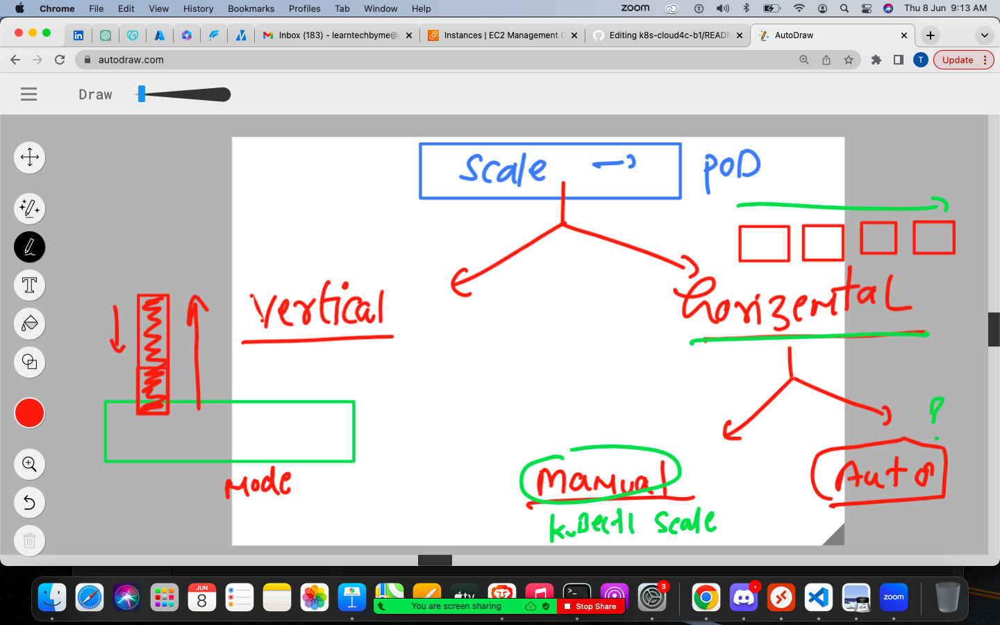
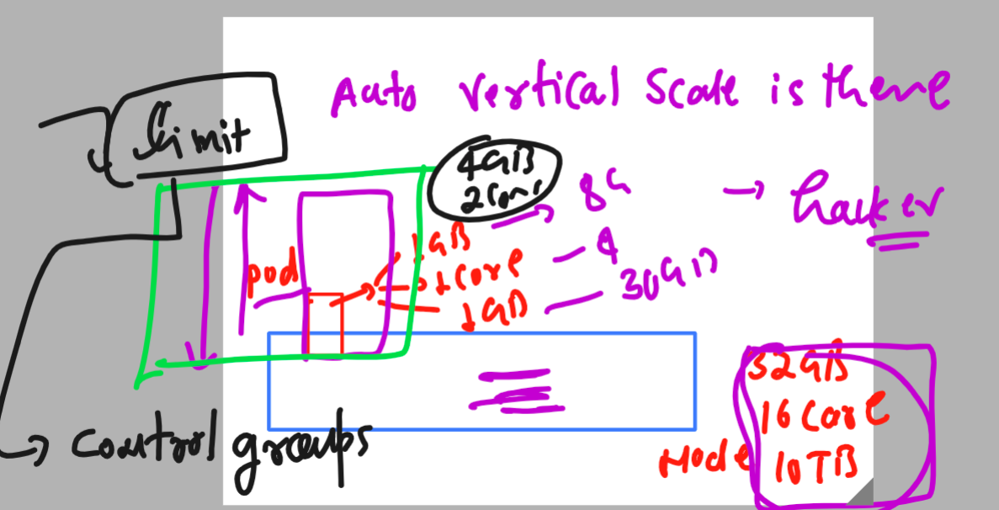

# k8s-cloud4c-b1

### pod scaling concept 



### introducing Resource limiting in single pod for vertical scaling -- by Control groups 



## tips 

### create new context and switching between 

```
[ec2-user@ip-172-31-35-0 ashu-codes]$ kubectl config get-contexts 
CURRENT   NAME                          CLUSTER      AUTHINFO           NAMESPACE
*         kubernetes-admin@kubernetes   kubernetes   kubernetes-admin   ashu-app
[ec2-user@ip-172-31-35-0 ashu-codes]$ 
[ec2-user@ip-172-31-35-0 ashu-codes]$ kubectl config set-context mytasks --cluster kubernetes --namespace tasks
Context "mytasks" created.
[ec2-user@ip-172-31-35-0 ashu-codes]$ 
[ec2-user@ip-172-31-35-0 ashu-codes]$ kubectl config get-contexts 
CURRENT   NAME                          CLUSTER      AUTHINFO           NAMESPACE
*         kubernetes-admin@kubernetes   kubernetes   kubernetes-admin   ashu-app
          mytasks                       kubernetes                      tasks
[ec2-user@ip-172-31-35-0 ashu-codes]$ kubectl config use-context mytasks 
Switched to context "mytasks".
[ec2-user@ip-172-31-35-0 ashu-codes]$ kubectl config get-contexts 
CURRENT   NAME                          CLUSTER      AUTHINFO           NAMESPACE
          kubernetes-admin@kubernetes   kubernetes   kubernetes-admin   ashu-app
*         mytasks                       kubernetes                      tasks
[ec2-user@ip-172-31-35-0 ashu-codes]$ 

```
