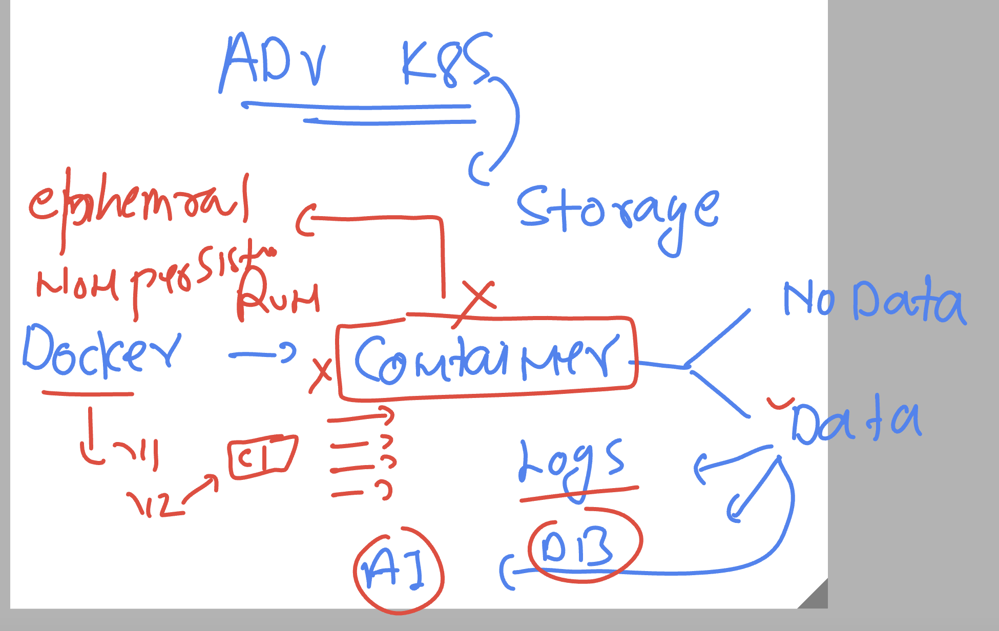
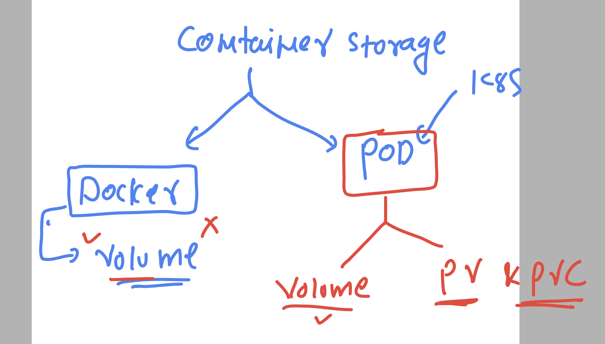
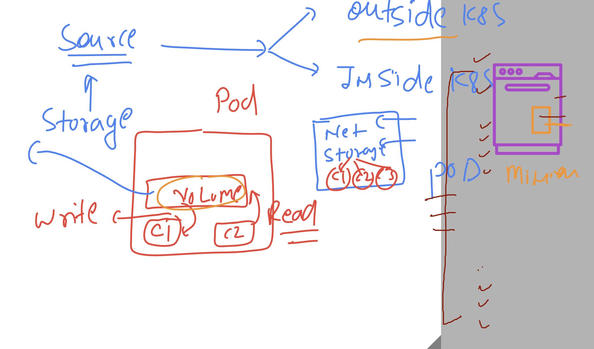
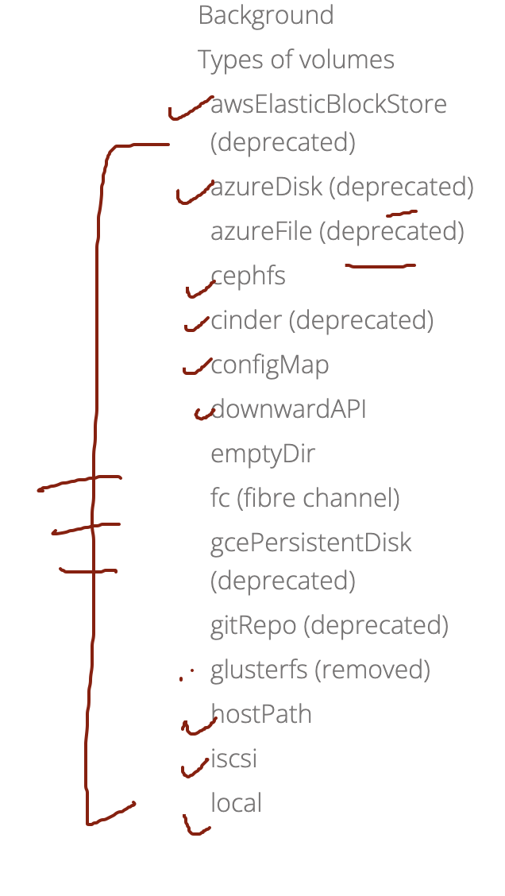
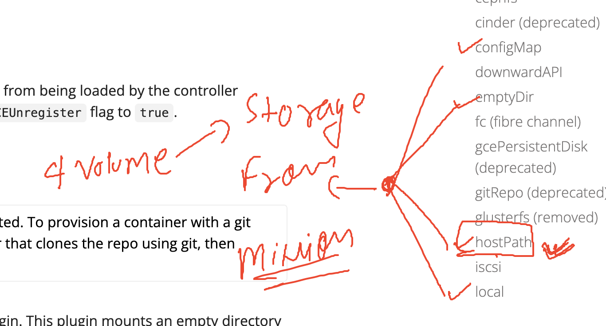

# k8s-cloud4c-b1

### checking connection of k8s cluster from k8s client 

```
[ec2-user@ip-172-31-35-0 ashu-codes]$ kubectl  config  get-contexts 
CURRENT   NAME                          CLUSTER      AUTHINFO           NAMESPACE
*         kubernetes-admin@kubernetes   kubernetes   kubernetes-admin   ashu-app
          mytasks                       kubernetes                      tasks
[ec2-user@ip-172-31-35-0 ashu-codes]$ kubectl   get nodes
NAME                                           STATUS   ROLES           AGE   VERSION
ip-172-31-0-78.ap-south-1.compute.internal     Ready    <none>          24d   v1.26.5
ip-172-31-0-83.ap-south-1.compute.internal     Ready    <none>          24d   v1.26.5
ip-172-31-11-234.ap-south-1.compute.internal   Ready    control-plane   24d   v1.26.5
ip-172-31-4-184.ap-south-1.compute.internal    Ready    <none>          24d   v1.26.5
ip-172-31-8-58.ap-south-1.compute.internal     Ready    <none>          24d   v1.26.5
[ec2-user@ip-172-31-35-0 ashu-codes]$ kubectl  get  all
NAME                           READY   STATUS    RESTARTS      AGE
pod/ashu-webapp-7748cd-bzvlh   1/1     Running   1 (28m ago)   3d22h
pod/ashu-webapp-7748cd-p9c4v   1/1     Running   1 (28m ago)   3d22h
pod/attack                     1/1     Running   1 (27m ago)   3d22h

NAME               TYPE       CLUSTER-IP      EXTERNAL-IP   PORT(S)        AGE
service/accesslb   NodePort   10.111.138.44   <none>        80:31377/TCP   3d22h

NAME                          READY   UP-TO-DATE   AVAILABLE   AGE
deployment.apps/ashu-webapp   2/2     2            2           3d22h

NAME                                 DESIRED   CURRENT   READY   AGE
replicaset.apps/ashu-webapp-7748cd   2         2         2       3d22h

NAME                                              REFERENCE                TARGETS   MINPODS   MAXPODS   REPLICAS   AGE
horizontalpodautoscaler.autoscaling/ashu-webapp   Deployment/ashu-webapp   0%/5%     2         15        2          3d22h
[ec2-user@ip-172-31-35-0 ashu-codes]$ kubectl  delete all --all
pod "ashu-webapp-7748cd-bzvlh" deleted
pod "ashu-webapp-7748cd-p9c4v" deleted
pod "attack" deleted
service "accesslb" deleted
deployment.apps "ashu-webapp" deleted
replicaset.apps "ashu-webapp-7748cd" deleted
horizontalpodautoscaler.autoscaling "ashu-webapp" deleted
```

## Storage 

### container Ephemral concept 



### Introducing container storage concept 



### Volume in k8s

### Storage source can be inside and outside k8s cluster 

### Inside cluster it will be the minion nodes 


### outside minion there are alot of options 



### type of volumes to take storage from Minion it self 



## testing hostPath volume 

### creating a pod without volume 

```
[ec2-user@ip-172-31-35-0 ashu-codes]$ ls
business-webapp  html-sample-app  java  java-webapp  k8s-app-deployment  mysql  python
[ec2-user@ip-172-31-35-0 ashu-codes]$ cd  k8s-app-deployment/
[ec2-user@ip-172-31-35-0 k8s-app-deployment]$ ls
ashu-ingress-routing-rule.yaml  azure_secret.yaml  hpa.yaml               mytask.yaml     podvolume1.yaml  uipod.yaml
ashupod_auto.yaml               cloudapp_pod.yaml  javaclusteripsvc.yaml  newapp.yaml     svcbyrc.yaml     webapp2.yaml
ashupod.json                    day10deploy.yaml   javaweb_deploy.yaml    nodeport1.yaml  svcday14.yaml
ashu-rc.yaml                    day14.yaml         lbupdate.yaml          nodeport2.yaml  task1.yaml
ashu-webapp-pod.yaml            deployment1.yaml   logs.txt               nodeport.yaml   tasks11.yaml
[ec2-user@ip-172-31-35-0 k8s-app-deployment]$ kubectl   run  ashupod1 --image=alpine --dry-run=client -o yaml >podvolume1.yaml 
[ec2-user@ip-172-31-35-0 k8s-app-deployment]$ 

```

### YAML update file

```
apiVersion: v1
kind: Pod
metadata:
  creationTimestamp: null
  labels: # labels of pod 
    run: ashupod1
  name: ashupod1 # name of pod
spec:
  containers:
  - image: alpine
    name: ashupod1
    command: ["/bin/sh","-c","while true;do echo Hello world >>/mnt/file.txt ; sleep 10;done"]
    resources: {}
    tty: True
  dnsPolicy: ClusterFirst
  restartPolicy: Always
status: {}

```

### deploy pod 

```
[ec2-user@ip-172-31-35-0 k8s-app-deployment]$ kubectl  apply -f podvolume1.yaml 
pod/ashupod1 configured
[ec2-user@ip-172-31-35-0 k8s-app-deployment]$ kubectl  get  po
NAME       READY   STATUS    RESTARTS   AGE
ashupod1   1/1     Running   0          81s
[ec2-user@ip-172-31-35-0 k8s-app-deployment]$ 

```

### lets check it 

```

```
