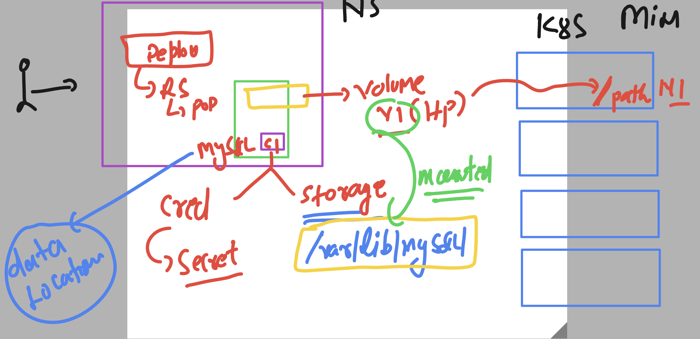
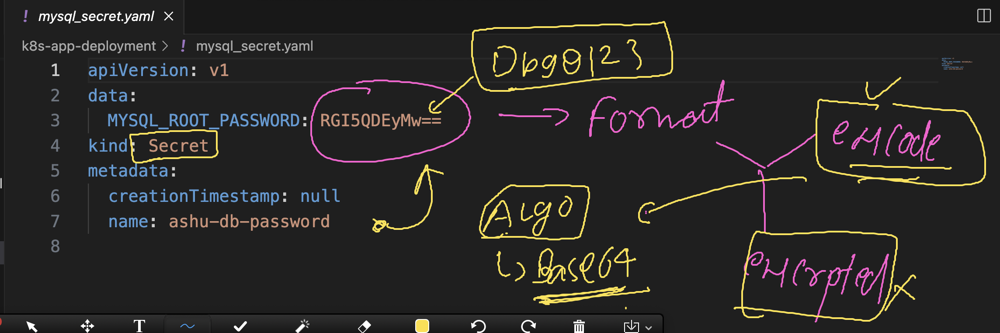

# k8s-cloud4c-b1

### Sample Database deployment in k8s using Deployment controller 

### Understanding database setup 



## Database deployment steps

### creating YAML for secret to store database creds

```
[ec2-user@ip-172-31-35-0 ashu-codes]$ kubectl  create secret 
Create a secret using specified subcommand.

Available Commands:
  docker-registry   Create a secret for use with a Docker registry
  generic           Create a secret from a local file, directory, or literal value
  tls               Create a TLS secret

Usage:
  kubectl create secret [flags] [options]

Use "kubectl <command> --help" for more information about a given command.
Use "kubectl options" for a list of global command-line options (applies to all commands).
[ec2-user@ip-172-31-35-0 ashu-codes]$ kubectl  create secret generic  ashu-db-password  --from-literal MYSQL_ROOT_PASSWORD="Db9@123" --dry-run=client -o yaml >mysql_secret.yaml
```

### secret is storing data in encoded format -- algo is base64



### creating deployment YAML 

```
kubectl  create  deployment  ashu-db --image mysql --port 3306 --dry-run=client -o yaml >mysql_deployment.yaml 
```

### updating volume info 

```
apiVersion: apps/v1
kind: Deployment
metadata:
  creationTimestamp: null
  labels:
    app: ashu-db
  name: ashu-db
spec:
  replicas: 1
  selector:
    matchLabels:
      app: ashu-db
  strategy: {}
  template: # template for creating pod 
    metadata:
      creationTimestamp: null
      labels:
        app: ashu-db
    spec:
      volumes: # to create volume 
      - name: ashu-mysql-vol
        hostPath:
          path: /db-ashu-data # create or use this location on the minion node
          type: DirectoryOrCreate  # if not existing then create it
      containers:
      - image: mysql
        name: mysql
        ports:
        - containerPort: 3306
        resources: {}
        volumeMounts: # to mount the volume
        - name: ashu-mysql-vol
          mountPath: /var/lib/mysql/ # location where mysql will be storing data
status: {}

```

### updating secret info 

```
apiVersion: apps/v1
kind: Deployment
metadata:
  creationTimestamp: null
  labels:
    app: ashu-db
  name: ashu-db
spec:
  replicas: 1
  selector:
    matchLabels:
      app: ashu-db
  strategy: {}
  template: # template for creating pod 
    metadata:
      creationTimestamp: null
      labels:
        app: ashu-db
    spec:
      volumes: # to create volume 
      - name: ashu-mysql-vol
        hostPath:
          path: /db-ashu-data # create or use this location on the minion node
          type: DirectoryOrCreate  # if not existing then create it
      containers:
      - image: mysql
        name: mysql
        ports:
        - containerPort: 3306
        resources: {}
        envFrom:
        - secretRef: # calling secret 
            name: ashu-db-password
        volumeMounts: # to mount the volume
        - name: ashu-mysql-vol
          mountPath: /var/lib/mysql/ # location where mysql will be storing data
status: {}

```

### lets deploy it 

```
[ec2-user@ip-172-31-35-0 k8s-app-deployment]$ kubectl  apply -f mysql_secret.yaml  -f mysql_deployment.yaml 
secret/ashu-db-password created
deployment.apps/ashu-db created
[ec2-user@ip-172-31-35-0 k8s-app-deployment]$ kubectl  get secret 
NAME               TYPE     DATA   AGE
ashu-db-password   Opaque   1      8s
[ec2-user@ip-172-31-35-0 k8s-app-deployment]$ kubectl  get deploy
NAME      READY   UP-TO-DATE   AVAILABLE   AGE
ashu-db   1/1     1            1           13s
[ec2-user@ip-172-31-35-0 k8s-app-deployment]$ kubectl  get rs
NAME                 DESIRED   CURRENT   READY   AGE
ashu-db-55db57667f   1         1         1       16s
[ec2-user@ip-172-31-35-0 k8s-app-deployment]$ kubectl  get pod
NAME                       READY   STATUS    RESTARTS   AGE
ashu-db-55db57667f-r7mx6   1/1     Running   0          19s
[ec2-user@ip-172-31-35-0 k8s-app-deployment]$ 


```
