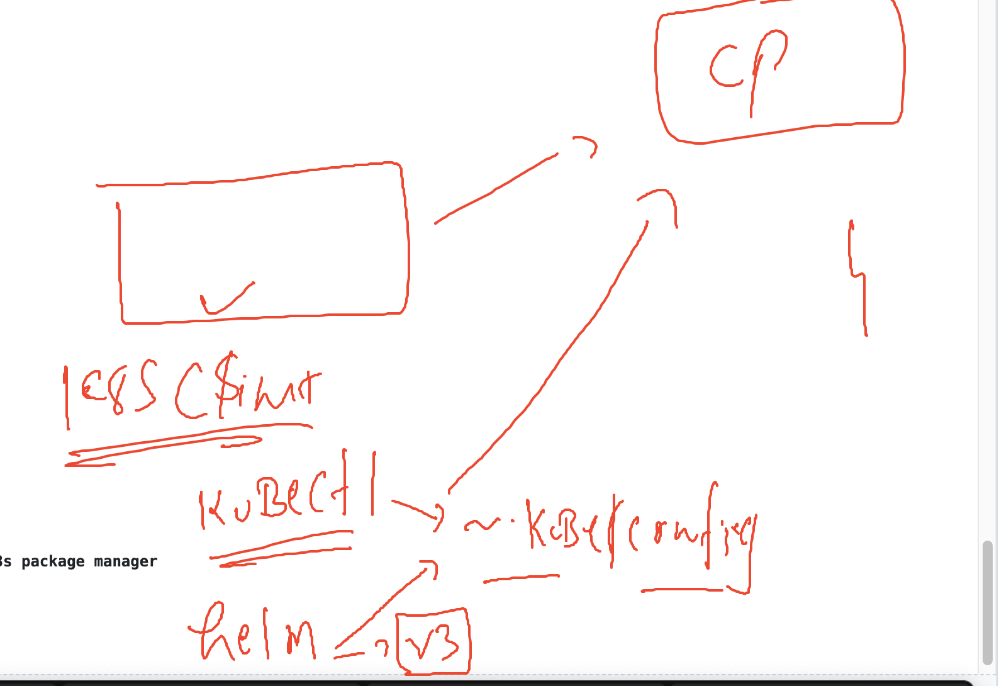

# k8s-cloud4c-b1

### Sample Database deployment in k8s using Deployment controller 

### Understanding database setup 


## Database deployment steps

### creating YAML for secret to store database creds

```
[ec2-user@ip-172-31-35-0 ashu-codes]$ kubectl  create secret 
Create a secret using specified subcommand.

Available Commands:
  docker-registry   Create a secret for use with a Docker registry
  generic           Create a secret from a local file, directory, or literal value
  tls               Create a TLS secret

Usage:
  kubectl create secret [flags] [options]

Use "kubectl <command> --help" for more information about a given command.
Use "kubectl options" for a list of global command-line options (applies to all commands).
[ec2-user@ip-172-31-35-0 ashu-codes]$ kubectl  create secret generic  ashu-db-password  --from-literal MYSQL_ROOT_PASSWORD="Db9@123" --dry-run=client -o yaml >mysql_secret.yaml
```

### secret is storing data in encoded format -- algo is base64


### creating deployment YAML 

```
kubectl  create  deployment  ashu-db --image mysql --port 3306 --dry-run=client -o yaml >mysql_deployment.yaml 
```

### updating volume info 

```
apiVersion: apps/v1
kind: Deployment
metadata:
  creationTimestamp: null
  labels:
    app: ashu-db
  name: ashu-db
spec:
  replicas: 1
  selector:
    matchLabels:
      app: ashu-db
  strategy: {}
  template: # template for creating pod 
    metadata:
      creationTimestamp: null
      labels:
        app: ashu-db
    spec:
      volumes: # to create volume 
      - name: ashu-mysql-vol
        hostPath:
          path: /db-ashu-data # create or use this location on the minion node
          type: DirectoryOrCreate  # if not existing then create it
      containers:
      - image: mysql
        name: mysql
        ports:
        - containerPort: 3306
        resources: {}
        volumeMounts: # to mount the volume
        - name: ashu-mysql-vol
          mountPath: /var/lib/mysql/ # location where mysql will be storing data
status: {}

```

### updating secret info 

```
apiVersion: apps/v1
kind: Deployment
metadata:
  creationTimestamp: null
  labels:
    app: ashu-db
  name: ashu-db
spec:
  replicas: 1
  selector:
    matchLabels:
      app: ashu-db
  strategy: {}
  template: # template for creating pod 
    metadata:
      creationTimestamp: null
      labels:
        app: ashu-db
    spec:
      volumes: # to create volume 
      - name: ashu-mysql-vol
        hostPath:
          path: /db-ashu-data # create or use this location on the minion node
          type: DirectoryOrCreate  # if not existing then create it
      containers:
      - image: mysql
        name: mysql
        ports:
        - containerPort: 3306
        resources: {}
        envFrom:
        - secretRef: # calling secret 
            name: ashu-db-password
        volumeMounts: # to mount the volume
        - name: ashu-mysql-vol
          mountPath: /var/lib/mysql/ # location where mysql will be storing data
status: {}

```

### lets deploy it 

```
[ec2-user@ip-172-31-35-0 k8s-app-deployment]$ kubectl  apply -f mysql_secret.yaml  -f mysql_deployment.yaml 
secret/ashu-db-password created
deployment.apps/ashu-db created
[ec2-user@ip-172-31-35-0 k8s-app-deployment]$ kubectl  get secret 
NAME               TYPE     DATA   AGE
ashu-db-password   Opaque   1      8s
[ec2-user@ip-172-31-35-0 k8s-app-deployment]$ kubectl  get deploy
NAME      READY   UP-TO-DATE   AVAILABLE   AGE
ashu-db   1/1     1            1           13s
[ec2-user@ip-172-31-35-0 k8s-app-deployment]$ kubectl  get rs
NAME                 DESIRED   CURRENT   READY   AGE
ashu-db-55db57667f   1         1         1       16s
[ec2-user@ip-172-31-35-0 k8s-app-deployment]$ kubectl  get pod
NAME                       READY   STATUS    RESTARTS   AGE
ashu-db-55db57667f-r7mx6   1/1     Running   0          19s
[ec2-user@ip-172-31-35-0 k8s-app-deployment]$ 


```
### accessing database pod container to start mysql 

```
[ec2-user@ip-172-31-35-0 k8s-app-deployment]$ kubectl  get  po
NAME                       READY   STATUS    RESTARTS   AGE
ashu-db-55db57667f-r7mx6   1/1     Running   0          12m
[ec2-user@ip-172-31-35-0 k8s-app-deployment]$ 
[ec2-user@ip-172-31-35-0 k8s-app-deployment]$ kubectl  exec -it ashu-db-55db57667f-r7mx6  -- bash 
bash-4.4# 
bash-4.4# 

bash-4.4# mysql -u root -p
Enter password: 
Welcome to the MySQL monitor.  Commands end with ; or \g.
Your MySQL connection id is 9
Server version: 8.0.33 MySQL Community Server - GPL

Copyright (c) 2000, 2023, Oracle and/or its affiliates.

Oracle is a registered trademark of Oracle Corporation and/or its
affiliates. Other names may be trademarks of their respective
owners.

Type 'help;' or '\h' for help. Type '\c' to clear the current input statement.

mysql> show databases;
+--------------------+
| Database           |
+--------------------+
| information_schema |
| mysql              |
| performance_schema |
| sys                |
+--------------------+
4 rows in set (0.01 sec)

mysql> exit;
Bye
bash-4.4# exit
exit
```

## Understanding pv and pvc 


### Understanding helm the k8s package manager 


### working of helm is same as kubectl 



### Installing helm in k8s client machine 

```
[root@ip-172-31-35-0 ~]# wget https://get.helm.sh/helm-v3.12.0-linux-amd64.tar.gz
--2023-06-13 05:05:01--  https://get.helm.sh/helm-v3.12.0-linux-amd64.tar.gz
Resolving get.helm.sh (get.helm.sh)... 152.199.39.108, 2606:2800:247:1cb7:261b:1f9c:2074:3c
Connecting to get.helm.sh (get.helm.sh)|152.199.39.108|:443... connected.
HTTP request sent, awaiting response... 200 OK
Length: 16041949 (15M) [application/x-tar]
Saving to: ‘helm-v3.12.0-linux-amd64.tar.gz’

100%[==========================================================================>] 16,041,949  --.-K/s   in 0.1s    

2023-06-13 05:05:01 (129 MB/s) - ‘helm-v3.12.0-linux-amd64.tar.gz’ saved [16041949/16041949]

[root@ip-172-31-35-0 ~]# ls
ashu-codes  helm-v3.12.0-linux-amd64.tar.gz  html-sample-app
[root@ip-172-31-35-0 ~]# tar xvzf  helm-v3.12.0-linux-amd64.tar.gz 
linux-amd64/
linux-amd64/helm
linux-amd64/README.md
linux-amd64/LICENSE
[root@ip-172-31-35-0 ~]# ls
ashu-codes  helm-v3.12.0-linux-amd64.tar.gz  html-sample-app  linux-amd64
[root@ip-172-31-35-0 ~]# cd  linux-amd64/
[root@ip-172-31-35-0 linux-amd64]# ls
helm  LICENSE  README.md
[root@ip-172-31-35-0 linux-amd64]# mv helm  /usr/bin/
[root@ip-172-31-35-0 linux-amd64]# 
[root@ip-172-31-35-0 linux-amd64]# 
[root@ip-172-31-35-0 linux-amd64]# helm version 
version.BuildInfo{Version:"v3.12.0", GitCommit:"c9f554d75773799f72ceef38c51210f1842a1dea", GitTreeState:"clean", GoVersion:"go1.20.3"}
[root@ip-172-31-35-0 linux-amd64]# 
```

### checking helm version with k8s client 

```
ec2-user@ip-172-31-35-0 k8s-app-deployment]$ helm version 
WARNING: Kubernetes configuration file is group-readable. This is insecure. Location: /home/ec2-user/.kube/config
WARNING: Kubernetes configuration file is world-readable. This is insecure. Location: /home/ec2-user/.kube/config
version.BuildInfo{Version:"v3.12.0", GitCommit:"c9f554d75773799f72ceef38c51210f1842a1dea", GitTreeState:"clean", GoVersion:"go1.20.3"}
[ec2-user@ip-172-31-35-0 k8s-app-deployment]$ 
[ec2-user@ip-172-31-35-0 k8s-app-deployment]$ 
[ec2-user@ip-172-31-35-0 k8s-app-deployment]$ chmod  600  /home/ec2-user/.kube/config
[ec2-user@ip-172-31-35-0 k8s-app-deployment]$ 
[ec2-user@ip-172-31-35-0 k8s-app-deployment]$ helm version 
version.BuildInfo{Version:"v3.12.0", GitCommit:"c9f554d75773799f72ceef38c51210f1842a1dea", GitTreeState:"clean", GoVersion:"go1.20.3"}
[ec2-user@ip-172-31-35-0 k8s-app-deployment]$ 
[ec2-user@ip-172-31-35-0 k8s-app-deployment]$ kubectl  version -o yaml
clientVersion:
  buildDate: "2023-05-17T14:20:07Z"
  compiler: gc
```

## lets get started with Helm 

### checking any existing list of repos 

```
[ec2-user@ip-172-31-35-0 k8s-app-deployment]$ helm  repo list
Error: no repositories to show
[ec2-user@ip-172-31-35-0 k8s-app-deployment]$ 

```

### add a repo 

```
[ec2-user@ip-172-31-35-0 k8s-app-deployment]$ helm repo add ashu-repo https://charts.bitnami.com/bitnami 
"ashu-repo" has been added to your repositories
[ec2-user@ip-172-31-35-0 k8s-app-deployment]$ 
[ec2-user@ip-172-31-35-0 k8s-app-deployment]$ helm  repo list
NAME            URL                               
ashu-repo       https://charts.bitnami.com/bitnami
[ec2-user@ip-172-31-35-0 k8s-app-deployment]$ 

```

### searching for particular package in repo 

```
[ec2-user@ip-172-31-35-0 k8s-app-deployment]$ helm search  repo  nginx 
NAME                                    CHART VERSION   APP VERSION     DESCRIPTION                                       
ashu-repo/nginx                         15.0.1          1.25.0          NGINX Open Source is a web server that can be a...
ashu-repo/nginx-ingress-controller      9.7.2           1.8.0           NGINX Ingress Controller is an Ingress controll...
ashu-repo/nginx-intel                   2.1.15          0.4.9           DEPRECATED NGINX Open Source for Intel is a lig...
[ec2-user@ip-172-31-35-0 k8s-app-deployment]$ 
[ec2-user@ip-172-31-35-0 k8s-app-deployment]$ helm search  repo mysql 
NAME                            CHART VERSION   APP VERSION     DESCRIPTION                                       
ashu-repo/mysql                 9.10.4          8.0.33          MySQL is a fast, reliable, scalable, and easy t...
ashu-repo/phpmyadmin            11.1.2          5.2.1           phpMyAdmin is a free software tool written in P...
ashu-repo/mariadb               12.2.5          10.11.4         MariaDB is an open source, community-developed ...
ashu-repo/mariadb-galera        8.2.5           10.11.4         MariaDB Galera is a multi-primary database clus...
```

### lets deploy app using helm repo 

```
[ec2-user@ip-172-31-35-0 k8s-app-deployment]$ helm search  repo  nginx 
NAME                                    CHART VERSION   APP VERSION     DESCRIPTION                                       
ashu-repo/nginx                         15.0.1          1.25.0          NGINX Open Source is a web server that can be a...
ashu-repo/nginx-ingress-controller      9.7.2           1.8.0           NGINX Ingress Controller is an Ingress controll...
ashu-repo/nginx-intel                   2.1.15          0.4.9           DEPRECATED NGINX Open Source for Intel is a lig...
[ec2-user@ip-172-31-35-0 k8s-app-deployment]$ 
[ec2-user@ip-172-31-35-0 k8s-app-deployment]$ kubectl  get  all
No resources found in ashu-app namespace.
[ec2-user@ip-172-31-35-0 k8s-app-deployment]$ 
[ec2-user@ip-172-31-35-0 k8s-app-deployment]$ 
[ec2-user@ip-172-31-35-0 k8s-app-deployment]$ helm repo list 
NAME            URL                               
ashu-repo       https://charts.bitnami.com/bitnami
[ec2-user@ip-172-31-35-0 k8s-app-deployment]$ 
[ec2-user@ip-172-31-35-0 k8s-app-deployment]$ 
[ec2-user@ip-172-31-35-0 k8s-app-deployment]$ 
[ec2-user@ip-172-31-35-0 k8s-app-deployment]$ helm install ashu-webapp  ashu-repo/nginx 
NAME: ashu-webapp
LAST DEPLOYED: Tue Jun 13 05:16:50 2023
NAMESPACE: ashu-app
STATUS: deployed
REVISION: 1
```

### lets verify 

```
ec2-user@ip-172-31-35-0 k8s-app-deployment]$ helm ls
NAME            NAMESPACE       REVISION        UPDATED                                 STATUS          CHART           APP VERSION
ashu-webapp     ashu-app        1               2023-06-13 05:16:50.297361536 +0000 UTC deployed        nginx-15.0.1    1.25.0     
[ec2-user@ip-172-31-35-0 k8s-app-deployment]$ 

----> using kubectl 
[ec2-user@ip-172-31-35-0 k8s-app-deployment]$ kubectl  get  deploy 
NAME                READY   UP-TO-DATE   AVAILABLE   AGE
ashu-webapp-nginx   1/1     1            1           97s
[ec2-user@ip-172-31-35-0 k8s-app-deployment]$ kubectl  get  rs
NAME                          DESIRED   CURRENT   READY   AGE
ashu-webapp-nginx-8d465c59c   1         1         1       100s
[ec2-user@ip-172-31-35-0 k8s-app-deployment]$ kubectl  get  po
NAME                                READY   STATUS    RESTARTS   AGE
ashu-webapp-nginx-8d465c59c-jntq7   1/1     Running   0          102s
[ec2-user@ip-172-31-35-0 k8s-app-deployment]$ 
[ec2-user@ip-172-31-35-0 k8s-app-deployment]$ kubectl  get  svc
NAME                TYPE           CLUSTER-IP      EXTERNAL-IP   PORT(S)        AGE
ashu-webapp-nginx   LoadBalancer   10.101.222.70   <pending>     80:30722/TCP   105s
```

