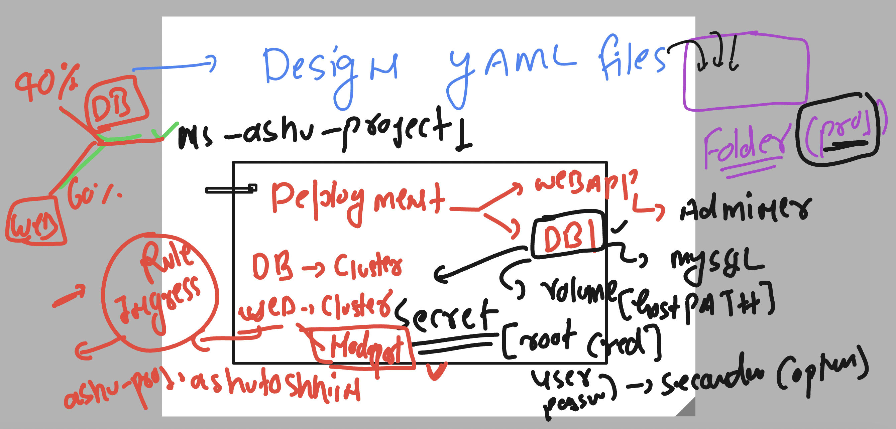

# k8s-cloud4c-b1

### cleaning up namespace data

```
[ec2-user@ip-172-31-35-0 ashu-codes]$ kubectl config get-contexts 
CURRENT   NAME                          CLUSTER      AUTHINFO           NAMESPACE
*         kubernetes-admin@kubernetes   kubernetes   kubernetes-admin   ashu-app
          mytasks                       kubernetes                      tasks
[ec2-user@ip-172-31-35-0 ashu-codes]$ kubectl get all
NAME                                    READY   STATUS    RESTARTS      AGE
pod/ashu-webapp-nginx-8d465c59c-jntq7   1/1     Running   1 (26m ago)   22h

NAME                        TYPE           CLUSTER-IP      EXTERNAL-IP   PORT(S)        AGE
service/ashu-webapp-nginx   LoadBalancer   10.101.222.70   <pending>     80:30722/TCP   22h

NAME                                READY   UP-TO-DATE   AVAILABLE   AGE
deployment.apps/ashu-webapp-nginx   1/1     1            1           22h

NAME                                          DESIRED   CURRENT   READY   AGE
replicaset.apps/ashu-webapp-nginx-8d465c59c   1         1         1       22h
[ec2-user@ip-172-31-35-0 ashu-codes]$ helm ls
NAME            NAMESPACE       REVISION        UPDATED                                 STATUS          CHART           APP VERSION
ashu-webapp     ashu-app        1               2023-06-13 05:16:50.297361536 +0000 UTC deployed        nginx-15.0.1    1.25.0     
[ec2-user@ip-172-31-35-0 ashu-codes]$ helm uninstall ashu-webapp
release "ashu-webapp" uninstalled
[ec2-user@ip-172-31-35-0 ashu-codes]$ kubectl  get  all
No resources found in ashu-app namespace.
[ec2-user@ip-172-31-35-0 ashu-codes]$ kubectl  delete all --al
error: unknown flag: --al
See 'kubectl delete --help' for usage.
[ec2-user@ip-172-31-35-0 ashu-codes]$ kubectl  delete all --all
No resources found
[ec2-user@ip-172-31-35-0 ashu-codes]$ kubectl  get  all
No resources found in ashu-app namespace.
```

## Project 1 



### Solution 

```
[ec2-user@ip-172-31-35-0 project1]$ kubectl   apply -f  . 
deployment.apps/ashu-mysqldb configured
namespace/ashu-project1 configured
secret/db-details configured
service/ashu-db-lb created
[ec2-user@ip-172-31-35-0 project1]$ kubectl  get  ns | grep ashu
ashu-app               Active   16d
ashu-project1          Active   29s
[ec2-user@ip-172-31-35-0 project1]$ kubectl  -n ashu-project1   get  secret 
NAME         TYPE     DATA   AGE
db-details   Opaque   1      37s
[ec2-user@ip-172-31-35-0 project1]$ kubectl  -n ashu-project1   get  svc
NAME         TYPE        CLUSTER-IP     EXTERNAL-IP   PORT(S)    AGE
ashu-db-lb   ClusterIP   10.102.0.233   <none>        3306/TCP   17s
[ec2-user@ip-172-31-35-0 project1]$ kubectl  -n ashu-project1   get  deploy 
NAME           READY   UP-TO-DATE   AVAILABLE   AGE
ashu-mysqldb   1/1     1            1           41s
[ec2-user@ip-172-31-35-0 project1]$ kubectl  -n ashu-project1   get  po 
NAME                            READY   STATUS    RESTARTS   AGE
ashu-mysqldb-569dcb97cf-9fctl   1/1     Running   0          47s
[ec2-user@ip-172-31-35-0 project1]$ 
```

### verify database details 

```
[ec2-user@ip-172-31-35-0 project1]$ kubectl  -n ashu-project1 get pod
NAME                            READY   STATUS    RESTARTS   AGE
ashu-mysqldb-569dcb97cf-9fctl   1/1     Running   0          2m51s
[ec2-user@ip-172-31-35-0 project1]$ kubectl  -n ashu-project1  exec -it ashu-mysqldb-569dcb97cf-9fctl -- bash 
bash-4.4# mysql -u root -p
Enter password: 
Welcome to the MySQL monitor.  Commands end with ; or \g.
Your MySQL connection id is 8
Server version: 8.0.33 MySQL Community Server - GPL

Copyright (c) 2000, 2023, Oracle and/or its affiliates.

Oracle is a registered trademark of Oracle Corporation and/or its
affiliates. Other names may be trademarks of their respective
owners.

Type 'help;' or '\h' for help. Type '\c' to clear the current input statement.

mysql> exit;
Bye
bash-4.4# exit
exit
[ec2-user@ip-172-31-35-0 project1]
```


