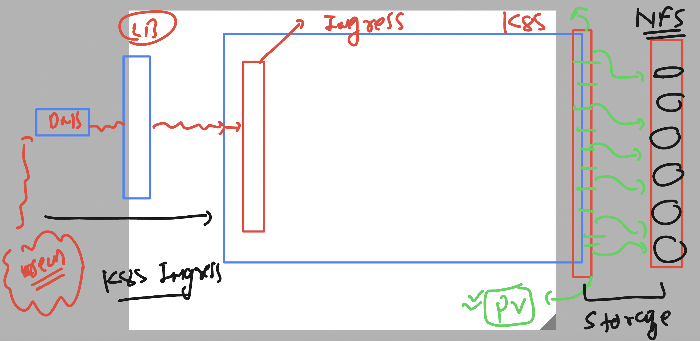

# k8s-cloud4c-b1

### Test lab Environment 

## project 2 ENV understanding 



## checking do we have Ingress deployed 

```
[ec2-user@ip-172-31-35-0 ashu-codes]$ kubectl  get  all -n ingress-nginx  
NAME                                            READY   STATUS      RESTARTS      AGE
pod/ingress-nginx-admission-create-gw6vp        0/1     Completed   0             8d
pod/ingress-nginx-admission-patch-fjdk6         0/1     Completed   1             8d
pod/ingress-nginx-controller-7c8b876764-xlphw   1/1     Running     6 (32m ago)   8d

NAME                                         TYPE        CLUSTER-IP       EXTERNAL-IP   PORT(S)                      AGE
service/ingress-nginx-controller             NodePort    10.106.129.113   <none>        80:31607/TCP,443:31470/TCP   8d
service/ingress-nginx-controller-admission   ClusterIP   10.102.161.103   <none>        443/TCP                      8d

NAME                                       READY   UP-TO-DATE   AVAILABLE   AGE
deployment.apps/ingress-nginx-controller   1/1     1            1           8d

NAME                                                  DESIRED   CURRENT   READY   AGE
replicaset.apps/ingress-nginx-controller-7c8b876764   1         1         1       8d

NAME                                       COMPLETIONS   DURATION   AGE
job.batch/ingress-nginx-admission-create   1/1           7s         8d
job.batch/ingress-nginx-admission-patch    1/1           9s         8d
```

### Deploying wordpress in k8s 

### creating a seperate directory 

```
[ec2-user@ip-172-31-35-0 ashu-codes]$ mkdir  ashu-wordpress
[ec2-user@ip-172-31-35-0 ashu-codes]$ cd ashu-wordpress/
[ec2-user@ip-172-31-35-0 ashu-wordpress]$ ls
[ec2-user@ip-172-31-35-0 ashu-wordpress]$ 

```

### lets create Persistent volume -- PV 

```
apiVersion: v1
kind: PersistentVolume
metadata:
  name: volume-by-ashu
spec: 
  capacity:
    storage: 3Gi # request for 3 GB (you can use 3 to 10 GB ) 
  accessModes: # where this storage can be attached in minion RWO , RWM , ROM
  - ReadWriteOnce # only single minion node will be able to mount it 
  storageClassName: manual # how storage is getting created 
  nfs: # from where  are getting storage to PV 
   server: 172.31.35.0 # ip address of NFS server 
   path: /data_store/rushi/ # locaiton on NFS server 
```

### lets create it 

```
[ec2-user@ip-172-31-35-0 ashu-wordpress]$ ls
pv.yaml
[ec2-user@ip-172-31-35-0 ashu-wordpress]$ kubectl  apply -f pv.yaml 
persistentvolume/volume-by-ashu created
[ec2-user@ip-172-31-35-0 ashu-wordpress]$ kubectl  get  pv
NAME             CAPACITY   ACCESS MODES   RECLAIM POLICY   STATUS      CLAIM   STORAGECLASS   REASON   AGE
volume-by-ashu   3Gi        RWO            Retain           Available           manual                  6s
[ec2-user@ip-172-31-35-0 ashu-wordpress]$ 
```

### claiming pv by creating PVC inside namespace 

```
apiVersion: v1
kind: PersistentVolumeClaim
metadata:
  name: ashu-pvc
spec:
  storageClassName: manual 
  accessModes:
  - ReadWriteOnce
  resources:
    requests:
      storage: 7Gi 
```

### create 

```
[ec2-user@ip-172-31-35-0 ashu-wordpress]$ kubectl apply -f pvc.yaml 
persistentvolumeclaim/ashu-pvc created
[ec2-user@ip-172-31-35-0 ashu-wordpress]$ kubectl  get  pvc
NAME       STATUS   VOLUME            CAPACITY   ACCESS MODES   STORAGECLASS   AGE
ashu-pvc   Bound    vloume-by-umend   7Gi        RWO            manual         4s
[ec2-user@ip-172-31-35-0 ashu-wordpress]$ kubectl  get  pv
NAME                 CAPACITY   ACCESS MODES   RECLAIM POLICY   STATUS      CLAIM               STORAGECLASS   REASON   AGE
shreyas-pv           3Gi        RWO            Retain           Available                       manual                  11m
vloume-by-umend      7Gi        RWO            Retain           Bound       ashu-app/ashu-pvc   manual                  13m
volume-by-ashu       3Gi        RWO            Retain           Available                       manual                  16m
volume-by-gaurav     4Gi        RWO          
```


