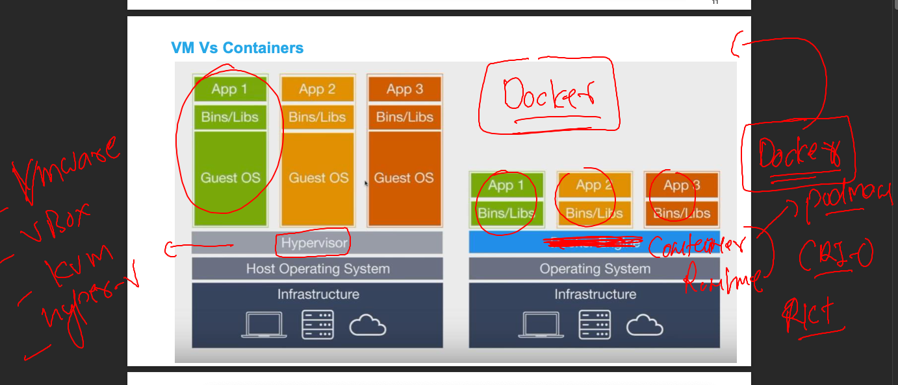
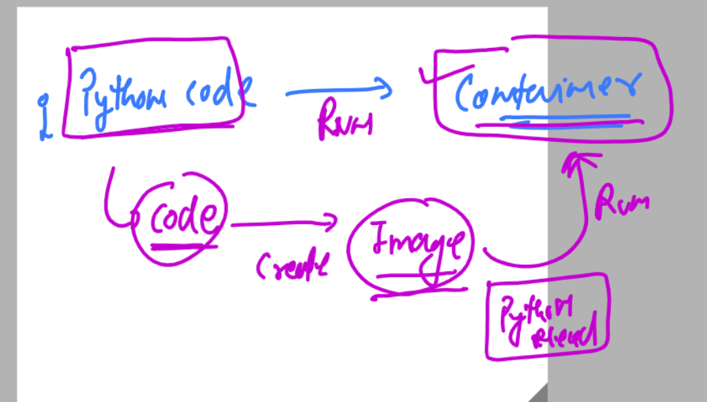
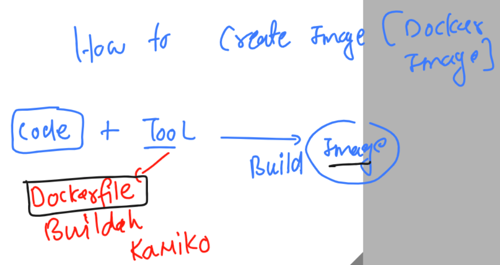

# k8s-cloud4c-b1

### Revision 



### any code you want to run in a container -- 
### there is two step process



## Introduction docker image building tools 



## Converting python code into docker image using Dockerfile 

### ashu.py -- python code 

```
import time

while True:
    print("Hello all , welcome to python..!!")
    time.sleep(3)
    print("Welcome to LnB..")
    time.sleep(2)
    print("Welcome to Containers ..!!")
    print("______________________")
    time.sleep(3)
```

### Dockerfile 

```
FROM python
# we are fetching python image lib from docker official 
LABEL name=ashutoshh
LABEL email=ashutoshh@linux.com 
#  image creator info -- optional field 
RUN mkdir  /code 
# creating folder inside image to store my code
COPY ashu.py /code/ashu.py 
# copy code inside image location 
CMD ["python","/code/ashu.py"]
# role of cmd is to tell docker 
# how to run your code -- whenever we create container from this image
```

### lets run docker file to build image 

```
[root@ip-172-31-35-0 ashu-codes]# ls
java  mysql  python
[root@ip-172-31-35-0 ashu-codes]# ls python/
Dockerfile  ashu.py
[root@ip-172-31-35-0 ashu-codes]# 
[root@ip-172-31-35-0 ashu-codes]# docker build -t ashu:pyv1 python/
Sending build context to Docker daemon  3.072kB
Step 1/6 : FROM python
latest: Pulling from library/python
918547b94326: Pull complete 
5d79063a01c5: Pull complete 
4eedd9c5abf7: Pull complete 
9cdadd40055f: Extracting [==========>                                        ]  42.89MB/196.8MB
2a12d0031f3f: Download complete 
24685c45a066: Download complete 
6ba57ec00f34: Download complete 
71bcc9787aa7: Download complete 


```

### lets check image 

```
[root@ip-172-31-35-0 ashu-codes]# docker images
REPOSITORY   TAG       IMAGE ID       CREATED          SIZE
ashu         pyv1      e41cd2bfd16b   15 seconds ago   920MB
python       latest    815c8c75dfc0   2 weeks ago      920MB
[root@ip-172-31-35-0 ashu-codes]# 

```


