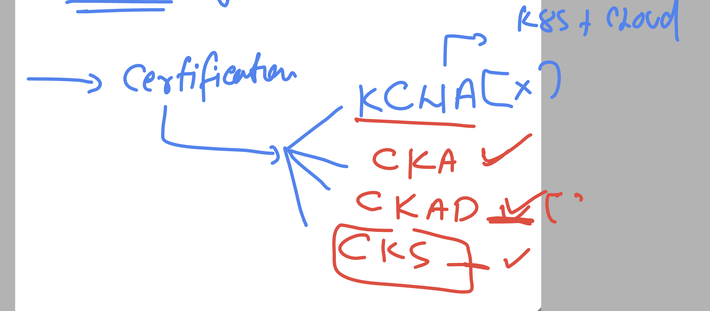
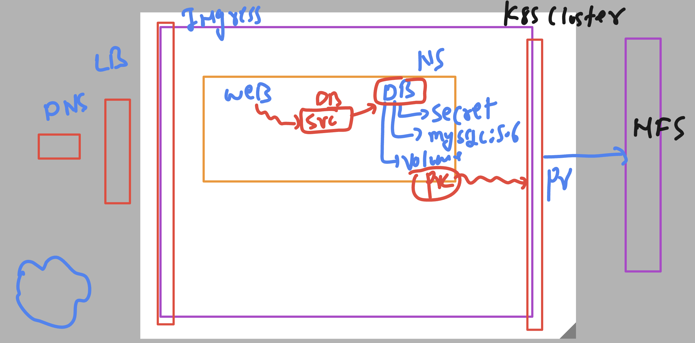

# k8s-cloud4c-b1

### Certification of k8s 



### CKA exam link 

[click Here](https://training.linuxfoundation.org/certification/certified-kubernetes-administrator-cka/)

## Project revision 



### verify implementations 

```
[ec2-user@ip-172-31-35-0 ashu-codes]$ kubectl  config get-contexts 
CURRENT   NAME                          CLUSTER      AUTHINFO           NAMESPACE
*         kubernetes-admin@kubernetes   kubernetes   kubernetes-admin   ashu-app
          mytasks                       kubernetes                      tasks
[ec2-user@ip-172-31-35-0 ashu-codes]$ kubectl  get  deploy 
NAME      READY   UP-TO-DATE   AVAILABLE   AGE
ashu-db   1/1     1            1           22h
[ec2-user@ip-172-31-35-0 ashu-codes]$ kubectl  get secret 
NAME                  TYPE     DATA   AGE
ashu-db-password      Opaque   1      2d23h
ashu-wordpress-pass   Opaque   1      23h

ec2-user@ip-172-31-35-0 ashu-codes]$ kubectl  get pvc
NAME       STATUS   VOLUME            CAPACITY   ACCESS MODES   STORAGECLASS   AGE
ashu-pvc   Bound    vloume-by-umend   7Gi        RW
```

### login to db just to check thing 

## getting passwrod 

```
ec2-user@ip-172-31-35-0 ashu-codes]$ kubectl  get  secret
NAME                  TYPE     DATA   AGE
ashu-db-password      Opaque   1      2d23h
ashu-wordpress-pass   Opaque   1      23h
[ec2-user@ip-172-31-35-0 ashu-codes]$ kubectl  get  secret ashu-wordpress-pass  -o yaml 
apiVersion: v1
data:
  mypass1: RGJXb3JkQDEyMzQ1
kind: Secret
metadata:
  annotations:
    kubectl.kubernetes.io/last-applied-configuration: |
      {"apiVersion":"v1","data":{"mypass1":"RGJXb3JkQDEyMzQ1"},"kind":"Secret","metadata":{"annotations":{},"creationTimestamp":null,"name":"ashu-wordpress-pass","namespace":"ashu-app"}}
  creationTimestamp: "2023-06-15T04:48:51Z"
  name: ashu-wordpress-pass
  namespace: ashu-app
  resourceVersion: "786124"
  uid: e29e9287-1150-47ba-8cd1-84f32d06571e
type: Opaque
[ec2-user@ip-172-31-35-0 ashu-codes]$ echo "RGJXb3JkQDEyMzQ1"  |  base64 -d
DbWord@12345[ec2-user@ip-172-31-35-0 ashu-codes]$ 


===login to db pod

[ec2-user@ip-172-31-35-0 ashu-codes]$ kubectl  get po 
NAME                       READY   STATUS    RESTARTS      AGE
ashu-db-6fcc8f7f94-d9v4m   1/1     Running   1 (63m ago)   22h
[ec2-user@ip-172-31-35-0 ashu-codes]$ kubectl  exec -it ashu-db-6fcc8f7f94-d9v4m -- bash 
root@ashu-db-6fcc8f7f94-d9v4m:/# mysql -u root -pDbWord@12345
Warning: Using a password on the command line interface can be insecure.
Welcome to the MySQL monitor.  Commands end with ; or \g.
Your MySQL connection id is 1
Server version: 5.6.51 MySQL Community Server (GPL)

Copyright (c) 2000, 2021, Oracle and/or its affiliates. All rights reserved.

Oracle is a registered trademark of Oracle Corporation and/or its
affiliates. Other names may be trademarks of their respective
owners.

Type 'help;' or '\h' for help. Type '\c' to clear the current input statement.

mysql> exit;
Bye
root@ashu-db-6fcc8f7f94-d9v4m:/# exit
exit
[ec2-user@ip-172-31-35-0 ashu-codes]$ 
```

