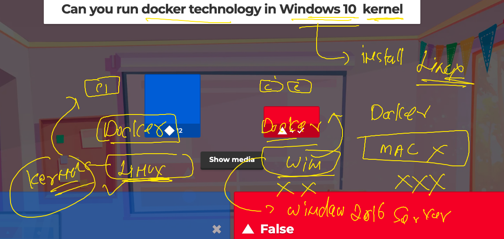

# k8s-cloud4c-b1

### Revision 


### Docker container in linux kernel 



### Java code to container 

### hello.java

```
class hello { 
    public static void main(String args[]) 
    { 
        // test expression 
        while (true) { 
            System.out.println("Hello World"); 
            try {
                Thread.sleep(2000);
            } catch (Exception ex) {
                // Ignored
            }
  
            // update expression 
        } 
    } 
} 
```

### Dockerfile 

```
FROM openjdk
LABEL email=ashutoshh@linux.com
RUN mkdir  /javacode 
COPY hello.java  /javacode/hello.java
WORKDIR /javacode
#  to change directory like cd command in linux / windows / mac 
RUN javac hello.java
# we are compiling code 
CMD ["java","hello"]

```

### lets build it 

```
[ec2-user@ip-172-31-35-0 ashu-codes]$ ls
java  mysql  python
[ec2-user@ip-172-31-35-0 ashu-codes]$ ls  java
Dockerfile  hello.java
[ec2-user@ip-172-31-35-0 ashu-codes]$ docker  build  -t  ashujava:v1  java/
Sending build context to Docker daemon  3.072kB
Step 1/7 : FROM openjdk
 ---> 71260f256d19
Step 2/7 : LABEL email=ashutoshh@linux.com
 ---> Running in c0a76b97cf74
Removing intermediate container c0a76b97cf74
 ---> 50afbd5c9590
Step 3/7 : RUN mkdir  /javacode
```

### lets checking images

```
[ec2-user@ip-172-31-35-0 ashu-codes]$ docker  images
REPOSITORY       TAG       IMAGE ID       CREATED              SIZE
saijava          v1        d718dbb3511d   9 seconds ago        470MB
sankarimajac     v12       46d018d3add8   15 seconds ago       470MB
ashujava         v1        4a1f8707e8e1   About a minute ago   470MB
shreyas_java     v1        0848eb15e047   About a minute ago   470MB
```

### creating container 

```
[ec2-user@ip-172-31-35-0 ashu-codes]$ docker images  |  grep ashu
ashujava         v1        4a1f8707e8e1   12 minutes ago   470MB
ashupython       v1        0e18b8a459fb   31 minutes ago   920MB
[ec2-user@ip-172-31-35-0 ashu-codes]$ 
[ec2-user@ip-172-31-35-0 ashu-codes]$ docker run -itd --name ashujc1  ashujava:v1 
75d1f3af1d3afb50a67236d1c1523f2fdf97f2310200d5f3310b95a3f3f0c57d
[ec2-user@ip-172-31-35-0 ashu-codes]$ docker  ps
CONTAINER ID   IMAGE         COMMAND        CREATED         STATUS        PORTS     NAMES
75d1f3af1d3a   ashujava:v1   "java hello"   2 seconds ago   Up 1 second             ashujc1
[ec2-user@ip-172-31-35-0 ashu-codes]$ docker logs  ashujc1
Hello World
Hello World
Hello World
Hello World
Hello World
Hello World
Hello World
```

### remove 

```
[ec2-user@ip-172-31-35-0 ashu-codes]$ docker stop ashujc1
ashujc1
[ec2-user@ip-172-31-35-0 ashu-codes]$ docker rm ashujc1
ashujc1
```
