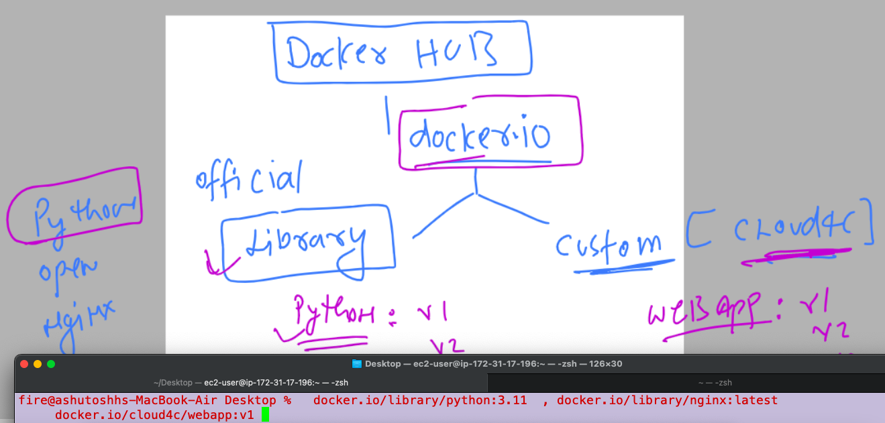

# k8s-cloud4c-b1

### Revision 


### Docker hub image storage understanding 



## steps for pushing image 

### tag as per docker hub standard 

```
[ec2-user@ip-172-31-35-0 ashu-codes]$ docker  images |  grep ashu
ashuwebsite       v1        58d297ac91bc   23 hours ago   144MB
ashujava          v1        4a1f8707e8e1   23 hours ago   470MB
ashupython        v1        0e18b8a459fb   24 hours ago   920MB
[ec2-user@ip-172-31-35-0 ashu-codes]$ docker  tag   ashuwebsite:v1   docker.io/dockerashu/cloud4cwebapp:1.1 
[ec2-user@ip-172-31-35-0 ashu-codes]$ 
[ec2-user@ip-172-31-35-0 ashu-codes]$ docker  images |  grep ashu
dockerashu/cloud4cwebapp   1.1       58d297ac91bc   23 hours ago   144MB
ashuwebsite                v1        58d297ac91bc   23 hours ago   144MB
ashujava                   v1        4a1f8707e8e1   23 hours ago   470MB
ashupython                 v1        0e18b8a459fb   24 hours ago   920MB
[ec2-user@ip-172-31-35-0 ashu-codes]$ 
```

### login to docker hub account from docker server 

```
[ec2-user@ip-172-31-35-0 ashu-codes]$ docker  login 
Login with your Docker ID to push and pull images from Docker Hub. If you don't have a Docker ID, head over to https://hub.docker.com to create one.
Username: dockerashu
Password: 
WARNING! Your password will be stored unencrypted in /home/ec2-user/.docker/config.json.
Configure a credential helper to remove this warning. See
https://docs.docker.com/engine/reference/commandline/login/#credentials-store

Login Succeeded
```

### now we can push image 

```
[ec2-user@ip-172-31-35-0 ashu-codes]$ docker push  docker.io/dockerashu/cloud4cwebapp:1.1
The push refers to repository [docker.io/dockerashu/cloud4cwebapp]
a75995ddf8a7: Pushing    2.1MB
4d33db9fdf22: Mounted from library/nginx 
6791458b3942: Mounted from library/nginx 
```


