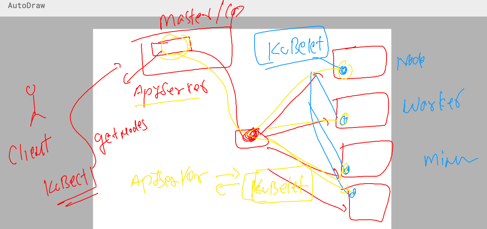

# k8s-cloud4c-b1

### Revision 


### Docker hub image storage understanding 


## steps for pushing image 

### tag as per docker hub standard 

```
[ec2-user@ip-172-31-35-0 ashu-codes]$ docker  images |  grep ashu
ashuwebsite       v1        58d297ac91bc   23 hours ago   144MB
ashujava          v1        4a1f8707e8e1   23 hours ago   470MB
ashupython        v1        0e18b8a459fb   24 hours ago   920MB
[ec2-user@ip-172-31-35-0 ashu-codes]$ docker  tag   ashuwebsite:v1   docker.io/dockerashu/cloud4cwebapp:1.1 
[ec2-user@ip-172-31-35-0 ashu-codes]$ 
[ec2-user@ip-172-31-35-0 ashu-codes]$ docker  images |  grep ashu
dockerashu/cloud4cwebapp   1.1       58d297ac91bc   23 hours ago   144MB
ashuwebsite                v1        58d297ac91bc   23 hours ago   144MB
ashujava                   v1        4a1f8707e8e1   23 hours ago   470MB
ashupython                 v1        0e18b8a459fb   24 hours ago   920MB
[ec2-user@ip-172-31-35-0 ashu-codes]$ 
```

### login to docker hub account from docker server 

```
[ec2-user@ip-172-31-35-0 ashu-codes]$ docker  login 
Login with your Docker ID to push and pull images from Docker Hub. If you don't have a Docker ID, head over to https://hub.docker.com to create one.
Username: dockerashu
Password: 
WARNING! Your password will be stored unencrypted in /home/ec2-user/.docker/config.json.
Configure a credential helper to remove this warning. See
https://docs.docker.com/engine/reference/commandline/login/#credentials-store

Login Succeeded
```

### now we can push image 

```
[ec2-user@ip-172-31-35-0 ashu-codes]$ docker push  docker.io/dockerashu/cloud4cwebapp:1.1
The push refers to repository [docker.io/dockerashu/cloud4cwebapp]
a75995ddf8a7: Pushing    2.1MB
4d33db9fdf22: Mounted from library/nginx 
6791458b3942: Mounted from library/nginx 
```

### a process for image build , test and push 


### scaling docker machine and handling their containers will be manual process 


### introduction to container orchestration 


### Info about kubernetes (k8s)


### k8s basic and simple architecture 


### how to connect k8s control plane -- using some given tools 


### Installing kubectl on k8s client machine 
### installation link 
[click_here](https://kubernetes.io/docs/tasks/tools/)

### installing it 

```
[ec2-user@ip-172-31-35-0 ashu-codes]$ sudo -i
[root@ip-172-31-35-0 ~]#  curl -LO "https://dl.k8s.io/release/$(curl -L -s https://dl.k8s.io/release/stable.txt)/bin/linux/amd64/kubectl"
  % Total    % Received % Xferd  Average Speed   Time    Time     Time  Current
                                 Dload  Upload   Total   Spent    Left  Speed
100   138  100   138    0     0    493      0 --:--:-- --:--:-- --:--:--   492
100 46.9M  100 46.9M    0     0  49.5M      0 --:--:-- --:--:-- --:--:-- 49.5M
[root@ip-172-31-35-0 ~]#    ls
ashu-codes  kubectl
[root@ip-172-31-35-0 ~]# mv kubectl /usr/bin/
[root@ip-172-31-35-0 ~]# chmod +x /usr/bin/kubectl 
[root@ip-172-31-35-0 ~]# logout
[ec2-user@ip-172-31-35-0 ashu-codes]$ kubectl  version --client 
WARNING: This version information is deprecated and will be replaced with the output from kubectl version --short.  Use --output=yaml|json to get the full version.
Client Version: version.Info{Major:"1", Minor:"27", GitVersion:"v1.27.2", GitCommit:"7f6f68fdabc4df88cfea2dcf9a19b2b830f1e647", GitTreeState:"clean", BuildDate:"2023-05-17T14:20:07Z", GoVersion:"go1.20.4", Compiler:"gc", Platform:"linux/amd64"}
Kustomize Version: v5.0.1
```

### following this 

```
[ec2-user@ip-172-31-35-0 ashu-codes]$ kubectl  version --client  -o yaml 
clientVersion:
  buildDate: "2023-05-17T14:20:07Z"
  compiler: gc
  gitCommit: 7f6f68fdabc4df88cfea2dcf9a19b2b830f1e647
  gitTreeState: clean
  gitVersion: v1.27.2
  goVersion: go1.20.4
  major: "1"
  minor: "27"
  platform: linux/amd64
kustomizeVersion: v5.0.1

[ec2-user@ip-172-31-35-0 ashu-codes]$ kubectl  version --client  -o json 
{
  "clientVersion": {
    "major": "1",
    "minor": "27",
    "gitVersion": "v1.27.2",
    "gitCommit": "7f6f68fdabc4df88cfea2dcf9a19b2b830f1e647",
    "gitTreeState": "clean",
    "buildDate": "2023-05-17T14:20:07Z",
    "goVersion": "go1.20.4",
```

### on windows 

```
PS C:\Users\hp>
PS C:\Users\hp> cd .\Downloads\
PS C:\Users\hp\Downloads> .\kubectl.exe  version --client -o yaml
clientVersion:
  buildDate: "2023-05-17T14:20:07Z"
  compiler: gc
  gitCommit: 7f6f68fdabc4df88cfea2dcf9a19b2b830f1e647
  gitTreeState: clean
  gitVersion: v1.27.2
  goVersion: go1.20.4
  major: "1"
  minor: "27"
  platform: windows/amd64
kustomizeVersion: v5.0.1

PS C:\Users\hp\Downloads> .\kubectl.exe  version --client -o json
{
  "clientVersion": {
    "major": "1",
    "minor": "27",
    "gitVersion": "v1.27.2",
    "gitCommit": "7f6f68fdabc4df88cfea2dcf9a19b2b830f1e647",
    "gitTreeState": "clean",
    "buildDate": "2023-05-17T14:20:07Z",
    "goVersion": "go1.20.4",
    "compiler": "gc",
    "platform": "windows/amd64"
  },
  "kustomizeVersion": "v5.0.1"
}
PS C:\Users\hp\Downloads>
```

### Understanding k8s master / control plane  -- apiserver component 


### kubernetes api-server connecting from client using kubectl 

### auth file on control plane 
```
[root@ip-172-31-11-234 ~]# cd  /etc/kubernetes/
[root@ip-172-31-11-234 kubernetes]# ls
admin.conf
```

### kubectl client machine need this file to connect control plane

```
[ec2-user@ip-172-31-35-0 ashu-codes]$ mkdir  ~/.kube 
[ec2-user@ip-172-31-35-0 ashu-codes]$ 
[ec2-user@ip-172-31-35-0 ashu-codes]$ cd  ~/.kube/
[ec2-user@ip-172-31-35-0 .kube]$ 
[ec2-user@ip-172-31-35-0 .kube]$ wget  http://15.206.151.147/admin.conf 
--2023-05-25 04:59:21--  http://15.206.151.147/admin.conf
Connecting to 15.206.151.147:80... connected.
HTTP request sent, awaiting response... 200 OK
Length: 5637 (5.5K) [text/plain]
Saving to: ‘admin.conf’

100%[===================================================================>] 5,637       --.-K/s   in 0s      

2023-05-25 04:59:21 (488 MB/s) - ‘admin.conf’ saved [5637/5637]

[ec2-user@ip-172-31-35-0 .kube]$ ls
admin.conf
[ec2-user@ip-172-31-35-0 .kube]$ mv admin.conf  config 
[ec2-user@ip-172-31-35-0 .kube]$ ls
config
[ec2-user@ip-172-31-35-0 .kube]$ 
```
### lets try some query to verify connection 

```
[ec2-user@ip-172-31-35-0 ashu-codes]$ kubectl   version -o yaml
clientVersion:
  buildDate: "2023-05-17T14:20:07Z"
  compiler: gc
  gitCommit: 7f6f68fdabc4df88cfea2dcf9a19b2b830f1e647
  gitTreeState: clean
  gitVersion: v1.27.2
  goVersion: go1.20.4
  major: "1"
  minor: "27"
  platform: linux/amd64
kustomizeVersion: v5.0.1
serverVersion:
  buildDate: "2023-05-17T14:08:49Z"
  compiler: gc
  gitCommit: 890a139214b4de1f01543d15003b5bda71aae9c7
  gitTreeState: clean
  gitVersion: v1.26.5
  goVersion: go1.19.9
  major: "1"
  minor: "26"
  platform: linux/amd64
```

### 

```
[ec2-user@ip-172-31-35-0 ashu-codes]$ kubectl   cluster-info 
Kubernetes control plane is running at https://172.31.11.234:6443
CoreDNS is running at https://172.31.11.234:6443/api/v1/namespaces/kube-system/services/kube-dns:dns/proxy

To further debug and diagnose cluster problems, use 'kubectl cluster-info dump'.
[ec2-user@ip-172-31-35-0 ashu-codes]$ 

```

### checking number of nodes / system / server in k8s architecture 

```
[ec2-user@ip-172-31-35-0 ashu-codes]$ kubectl   get  nodes
NAME                                           STATUS   ROLES           AGE    VERSION
ip-172-31-0-78.ap-south-1.compute.internal     Ready    <none>          6d2h   v1.26.5
ip-172-31-0-83.ap-south-1.compute.internal     Ready    <none>          6d2h   v1.26.5
ip-172-31-11-234.ap-south-1.compute.internal   Ready    control-plane   6d2h   v1.26.5
ip-172-31-4-184.ap-south-1.compute.internal    Ready    <none>          6d2h   v1.26.5
ip-172-31-8-58.ap-south-1.compute.internal     Ready    <none>          6d2h   v1.26.5
[ec2-user@ip-172-31-35-0 ashu-codes]$ 
```

### api-server and kubelet 




