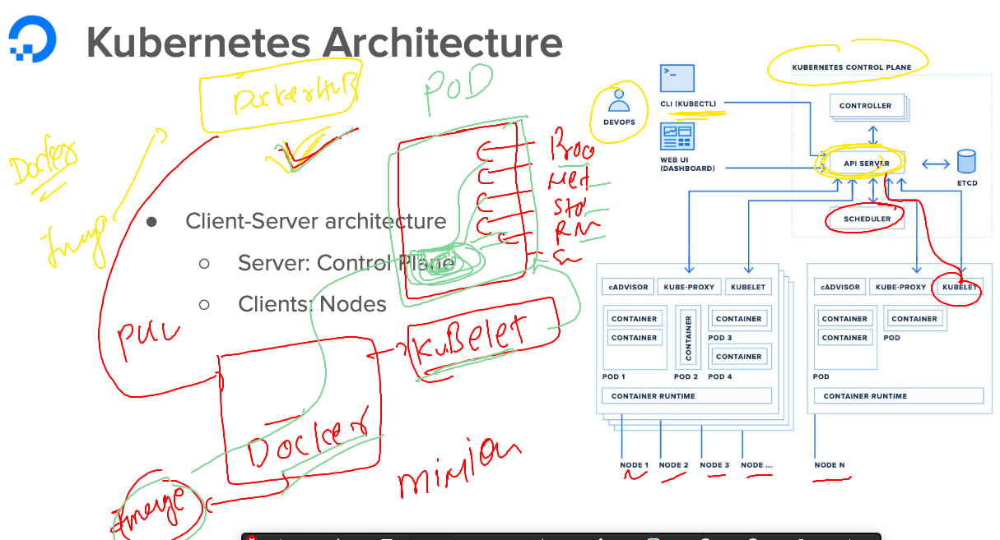

# k8s-cloud4c-b1

### Revision and use of docker and k8s 


### How docker is creating and managing all the details of containers


## Now let the k8s handle almost all the things except creating containers




### to create pod in kubernetes -- best way to write instruction in a file 


### yaml basic understanding


### understanding role of etcd 


### sample pod yaml 

```
apiVersion: v1  # k8s master api-server version 
kind: Pod # i want to talk about pod to my master server 
metadata: # for details about pod 
  name: ashu-app-pod1 
spec: # your container details 
  containers:
  - image: docker.io/dockerashu/cloud4cwebapp:1.1 # image from docker hub 
    name: ashuc1
    ports: # app port optional field 
    - containerPort: 80 
```

### sending create request to api-server

```
[ec2-user@ip-172-31-35-0 k8s-app-deployment]$ ls
ashu-webapp-pod.yaml
[ec2-user@ip-172-31-35-0 k8s-app-deployment]$ kubectl   create  -f  ashu-webapp-pod.yaml 
pod/ashu-app-pod1 created
[ec2-user@ip-172-31-35-0 k8s-app-deployment]$ kubectl   get  pods
NAME            READY   STATUS    RESTARTS   AGE
ashu-app-pod1   2/2     Running   0          10s
[ec2-user@ip-172-31-35-0 k8s-app-deployment]$ 
```

### for troubleshooting we can use describe command 

```
[ec2-user@ip-172-31-35-0 k8s-app-deployment]$ kubectl   describe  pod  kush-app-pod1 
Name:             kush-app-pod1
Namespace:        default
Priority:         0
Service Account:  default
Node:             ip-172-31-8-58.ap-south-1.compute.internal/172.31.8.58
Start Time:       Fri, 26 May 2023 04:48:41 +0000
Labels:           security.istio.io/tlsMode=istio
                  service.istio.io/canonical-name=kush-app-pod1
                  service.istio.io/canonical-revision=latest
Annotations:      cni.projectcalico.org/containerID: ca9e1da0b49b71f840be9c5
```

### checking pod more details 

```
[ec2-user@ip-172-31-35-0 k8s-app-deployment]$ kubectl   get  nodes 
NAME                                           STATUS   ROLES           AGE    VERSION
ip-172-31-0-78.ap-south-1.compute.internal     Ready    <none>          7d2h   v1.26.5
ip-172-31-0-83.ap-south-1.compute.internal     Ready    <none>          7d2h   v1.26.5
ip-172-31-11-234.ap-south-1.compute.internal   Ready    control-plane   7d2h   v1.26.5
ip-172-31-4-184.ap-south-1.compute.internal    Ready    <none>          7d2h   v1.26.5
ip-172-31-8-58.ap-south-1.compute.internal     Ready    <none>          7d2h   v1.26.5
[ec2-user@ip-172-31-35-0 k8s-app-deployment]$ kubectl  get pod
NAME                READY   STATUS             RESTARTS   AGE
aman-app-pod1       2/2     Running            0          17m
ashu-app-pod1       2/2     Running            0          18m
gaurav-app-pod1     2/2     Running            0          6m22s
gnanasai-app-pod1   2/2     Running            0          9m43s
kush-app-pod1       1/2     ImagePullBackOff   0          11m
neha-app-pod1       2/2     Running            0          12m
sankar-app-pod1     2/2     Running            0          16m
shreyas-app-pod1    2/2     Running            0          12m
srujana             2/2     Running            0          10m
umend-pod1          2/2     Running            0          16m
yuva-app-pod1       2/2     Running            0          18m
[ec2-user@ip-172-31-35-0 k8s-app-deployment]$ kubectl  get pod  ashu-app-pod1  -o wide
NAME            READY   STATUS    RESTARTS   AGE   IP                NODE                                         NOMINATED NODE   READINESS GATES
ashu-app-pod1   2/2     Running   0          18m   192.168.172.204   ip-172-31-0-83.ap-south-1.compute.internal   <none>           <none>
[ec2-user@ip-172-31-35-0 k8s-app-deployment]$ 

```

### checking logs of pod 

```
ec2-user@ip-172-31-35-0 k8s-app-deployment]$ kubectl   logs  ashu-app-pod1
/docker-entrypoint.sh: /docker-entrypoint.d/ is not empty, will attempt to perform configuration
/docker-entrypoint.sh: Looking for shell scripts in /docker-entrypoint.d/
/docker-entrypoint.sh: Launching /docker-entrypoint.d/10-listen-on-ipv6-by-default.sh
10-listen-on-ipv6-by-default.sh: info: Getting the checksum of /etc/nginx/conf.d/default.conf
10-listen-on-ipv6-by-default.sh: info: Enabled listen on IPv6 in /etc/nginx/conf.d/default.conf
/docker-entrypoint.sh: Launching /docker-entrypoint.d/20-envsubst-on-templates.sh
/docker-entrypoint.sh: Launching /docker-entrypoint.d/30-tune-worker-processes.sh
/docker-entrypoint.sh: Configuration complete; ready for start up
```

### deleting pod 

```
[ec2-user@ip-172-31-35-0 k8s-app-deployment]$ kubectl  delete pod  ashu-app-pod1
pod "ashu-app-pod1" deleted
[ec2-user@ip-172-31-35-0 k8s-app-deployment]$ kubectl  get pods
NAME                READY   STATUS             RESTARTS   AGE
aman-app-pod1       2/2     Running            0          19m
gaurav-app-pod1     2/2     Running            0          9m16s
gnanasai-app-pod1   2/2     Running            0          12m
kush-app-pod1       1/2     ImagePullBackOff   0          14m
```


