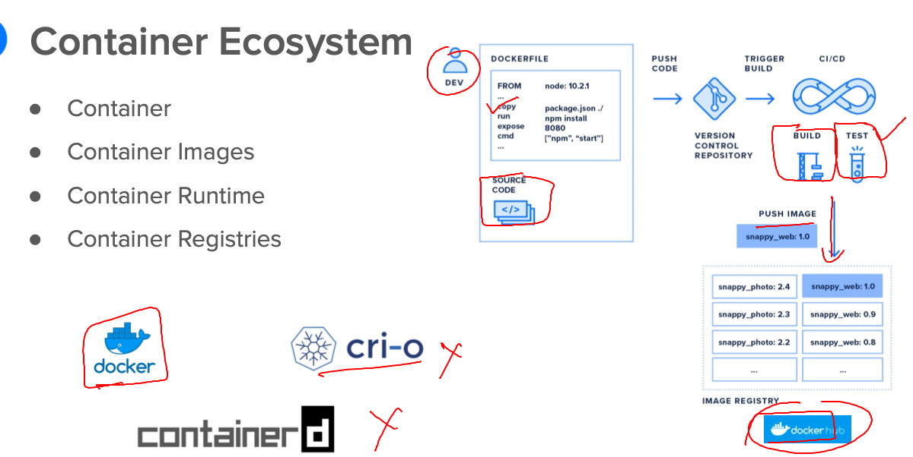
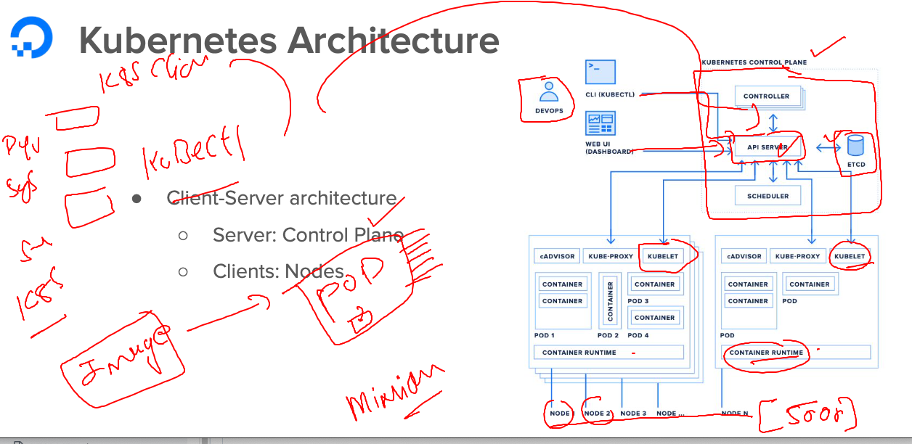

# k8s-cloud4c-b1

### Revision 



### k8s rev 



### lab topology 


### verify connection with k8s control plane 

```
[ec2-user@ip-172-31-35-0 ashu-codes]$ 
[ec2-user@ip-172-31-35-0 ashu-codes]$ kubectl  cluster-info 
Kubernetes control plane is running at https://172.31.11.234:6443
CoreDNS is running at https://172.31.11.234:6443/api/v1/namespaces/kube-system/services/kube-dns:dns/proxy

To further debug and diagnose cluster problems, use 'kubectl cluster-info dump'.
[ec2-user@ip-172-31-35-0 ashu-codes]$ kubectl  get nodes
NAME                                           STATUS   ROLES           AGE   VERSION
ip-172-31-0-78.ap-south-1.compute.internal     Ready    <none>          10d   v1.26.5
ip-172-31-0-83.ap-south-1.compute.internal     Ready    <none>          10d   v1.26.5
ip-172-31-11-234.ap-south-1.compute.internal   Ready    control-plane   10d   v1.26.5
ip-172-31-4-184.ap-south-1.compute.internal    Ready    <none>          10d   v1.26.5
ip-172-31-8-58.ap-south-1.compute.internal     Ready    <none>          10d   v1.26.5
[ec2-user@ip-172-31-35-0 ashu-codes]$ kubectl  get  pods
No resources found in default namespace.
[ec2-user@ip-172-31-35-0 ashu-codes]$ 


```

### creating pod from cli 

```
[ec2-user@ip-172-31-35-0 k8s-app-deployment]$ kubectl  run  ashuwebpod  --image=docker.io/dockerashu/banasthali:appv1  --port 80  
pod/ashuwebpod created
[ec2-user@ip-172-31-35-0 k8s-app-deployment]$ kubectl  get  po 
NAME         READY   STATUS            RESTARTS   AGE
ashuwebpod   0/2     PodInitializing   0          4s
[ec2-user@ip-172-31-35-0 k8s-app-deployment]$ kubectl delete pod ashuwebpod
pod "ashuwebpod" deleted

```

### creating yaml / json from client 

```
[ec2-user@ip-172-31-35-0 k8s-app-deployment]$ kubectl  run  ashuwebpod  --image=docker.io/dockerashu/banasthali:appv1  --port 80  --dry-run=client  -o yaml 
apiVersion: v1
kind: Pod
metadata:
  creationTimestamp: null
  labels:
    run: ashuwebpod
  name: ashuwebpod
spec:
  containers:
  - image: docker.io/dockerashu/banasthali:appv1
    name: ashuwebpod
    ports:
    - containerPort: 80
    resources: {}
  dnsPolicy: ClusterFirst
  restartPolicy: Always
status: {}
[ec2-user@ip-172-31-35-0 k8s-app-deployment]$ kubectl  run  ashuwebpod  --image=docker.io/dockerashu/banasthali:appv1  --port 80  --dry-run=client  -o yaml  >ashupod_auto.yaml 
[ec2-user@ip-172-31-35-0 k8s-app-deployment]$ 
```

