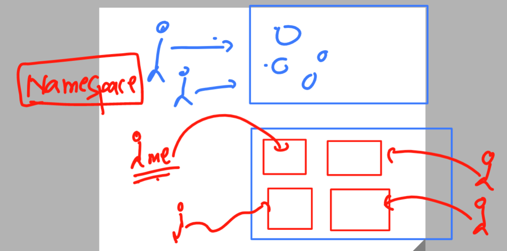
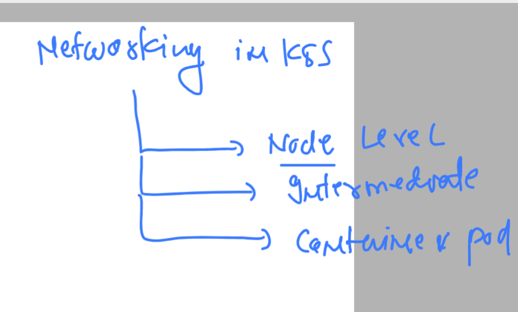
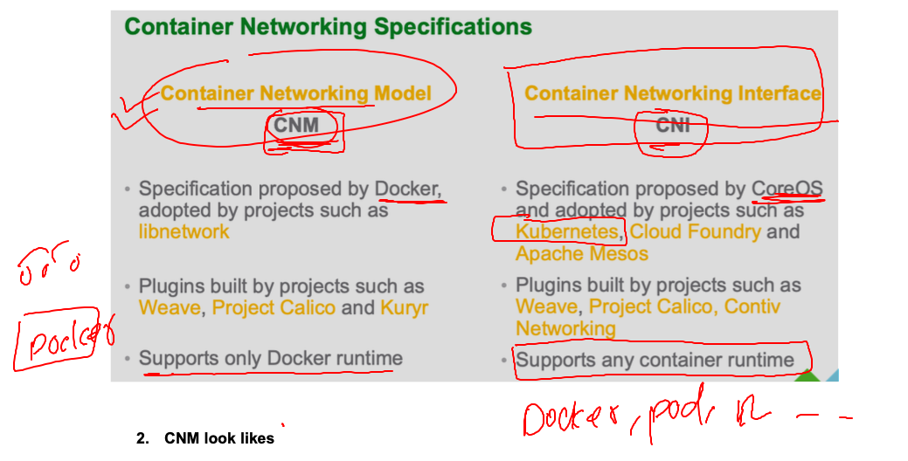
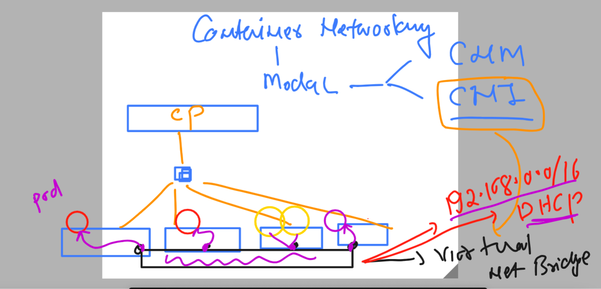

# k8s-cloud4c-b1

### Revision 


### k8s rev 


### lab topology 


### verify connection with k8s control plane 

```
[ec2-user@ip-172-31-35-0 ashu-codes]$ 
[ec2-user@ip-172-31-35-0 ashu-codes]$ kubectl  cluster-info 
Kubernetes control plane is running at https://172.31.11.234:6443
CoreDNS is running at https://172.31.11.234:6443/api/v1/namespaces/kube-system/services/kube-dns:dns/proxy

To further debug and diagnose cluster problems, use 'kubectl cluster-info dump'.
[ec2-user@ip-172-31-35-0 ashu-codes]$ kubectl  get nodes
NAME                                           STATUS   ROLES           AGE   VERSION
ip-172-31-0-78.ap-south-1.compute.internal     Ready    <none>          10d   v1.26.5
ip-172-31-0-83.ap-south-1.compute.internal     Ready    <none>          10d   v1.26.5
ip-172-31-11-234.ap-south-1.compute.internal   Ready    control-plane   10d   v1.26.5
ip-172-31-4-184.ap-south-1.compute.internal    Ready    <none>          10d   v1.26.5
ip-172-31-8-58.ap-south-1.compute.internal     Ready    <none>          10d   v1.26.5
[ec2-user@ip-172-31-35-0 ashu-codes]$ kubectl  get  pods
No resources found in default namespace.
[ec2-user@ip-172-31-35-0 ashu-codes]$ 


```

### creating pod from cli 

```
[ec2-user@ip-172-31-35-0 k8s-app-deployment]$ kubectl  run  ashuwebpod  --image=docker.io/dockerashu/banasthali:appv1  --port 80  
pod/ashuwebpod created
[ec2-user@ip-172-31-35-0 k8s-app-deployment]$ kubectl  get  po 
NAME         READY   STATUS            RESTARTS   AGE
ashuwebpod   0/2     PodInitializing   0          4s
[ec2-user@ip-172-31-35-0 k8s-app-deployment]$ kubectl delete pod ashuwebpod
pod "ashuwebpod" deleted

```

### creating yaml / json from client 

```
[ec2-user@ip-172-31-35-0 k8s-app-deployment]$ kubectl  run  ashuwebpod  --image=docker.io/dockerashu/banasthali:appv1  --port 80  --dry-run=client  -o yaml 
apiVersion: v1
kind: Pod
metadata:
  creationTimestamp: null
  labels:
    run: ashuwebpod
  name: ashuwebpod
spec:
  containers:
  - image: docker.io/dockerashu/banasthali:appv1
    name: ashuwebpod
    ports:
    - containerPort: 80
    resources: {}
  dnsPolicy: ClusterFirst
  restartPolicy: Always
status: {}
[ec2-user@ip-172-31-35-0 k8s-app-deployment]$ kubectl  run  ashuwebpod  --image=docker.io/dockerashu/banasthali:appv1  --port 80  --dry-run=client  -o yaml  >ashupod_auto.yaml 
[ec2-user@ip-172-31-35-0 k8s-app-deployment]$ 
```
### creating json file as well

```
[ec2-user@ip-172-31-35-0 k8s-app-deployment]$ kubectl  run  ashuwebpod  --image=docker.io/dockerashu/banasthali:appv1  --port 80  --dry-run=client  -o json  >ashupod.json 
[ec2-user@ip-172-31-35-0 k8s-app-deployment]$ ls
ashupod_auto.yaml  ashupod.json  ashu-webapp-pod.yaml
[ec2-user@ip-172-31-35-0 k8s-app-deployment]$ 
```

### creating pod 

```
[ec2-user@ip-172-31-35-0 k8s-app-deployment]$ ls
ashupod_auto.yaml  ashupod.json  ashu-webapp-pod.yaml
[ec2-user@ip-172-31-35-0 k8s-app-deployment]$ kubectl create -f  ashupod_auto.yaml 
pod/ashuwebpod created
[ec2-user@ip-172-31-35-0 k8s-app-deployment]$ kubectl  get pods
NAME           READY   STATUS            RESTARTS   AGE
ashuwebpod     0/2     PodInitializing   0          4s
gauravwebpod   2/2     Running           0          3m14s
[ec2-user@ip-172-31-35-0 k8s-app-deployment]$ 
```

### deleting pods 

```
[ec2-user@ip-172-31-35-0 k8s-app-deployment]$ kubectl  get  po 
NAME              READY   STATUS             RESTARTS   AGE
amanpod           2/2     Running            0          3m31s
ashuwebpod        2/2     Running            0          2m25s
gauravwebpod      2/2     Running            0          7m18s
gnanawebpod       2/2     Running            0          3m8s
kushwebpod        2/2     Running            0          3m12s
shreyas-web-pod   2/2     Running            0          2m3s
sowmyawebpod      1/2     ImagePullBackOff   0          2m47s
yuvawebpod        2/2     Running            0          3m10s
[ec2-user@ip-172-31-35-0 k8s-app-deployment]$ kubectl  delete -f  ashupod_auto.yaml 
pod "ashuwebpod" deleted
[ec2-user@ip-172-31-35-0 k8s-app-deployment]$ kubectl delete pods --all
pod "amanpod" deleted
pod "gauravwebpod" deleted
pod "gnanawebpod" deleted
pod "kushwebpod" deleted
pod "shreyas-web-pod" delete
```

## Introduction to k8s -- for having private isolation and limitations 



### listing namespaces in k8s

```
[ec2-user@ip-172-31-35-0 k8s-app-deployment]$ kubectl  get  pods
No resources found in default namespace.
[ec2-user@ip-172-31-35-0 k8s-app-deployment]$ kubectl   get   ns
NAME              STATUS   AGE
default           Active   10d
dynatrace         Active   3d22h
istio-system      Active   3d22h
kube-node-lease   Active   10d
kube-public       Active   10d
kube-system       Active   10d
[ec2-user@ip-172-31-35-0 k8s-app-deployment]$ 
```

### creating namespace and setting it default for my self 

```
[ec2-user@ip-172-31-35-0 k8s-app-deployment]$ kubectl   create   namespace  ashu-app
namespace/ashu-app created
[ec2-user@ip-172-31-35-0 k8s-app-deployment]$ kubectl  get   ns
NAME              STATUS   AGE
ashu-app          Active   4s
default           Active   10d
dynatrace         Active   3d22h
istio-system      Active   3d22h
kube-node-lease   Active   10d
kube-public       Active   10d
kube-system       Active   10d
[ec2-user@ip-172-31-35-0 k8s-app-deployment]$ kubectl  config set-context --current --namespace=ashu-app
Context "kubernetes-admin@kubernetes" modified.
[ec2-user@ip-172-31-35-0 k8s-app-deployment]$ kubectl   get  pods
No resources found in ashu-app namespace.
[ec2-user@ip-172-31-35-0 k8s-app-deployment]$ 


```

## NEtworking in k8s 

### LEvel of networking 



### read firewall rules for k8s cluster 

[click_here](https://kubernetes.io/docs/reference/networking/ports-and-protocols/)

### Container networking modesl -- CNI will be used by k8s 



### Distributed Bridge networking by CNI on k8s minion nodes -- to assign ip address for pods 




### we are using project calico to implement CNI in k8s  but there are many other project  / plugins we are having

### list is here 

[click_here](https://github.com/containernetworking/cni)


### we are getting response from other node pod 

```
[ec2-user@ip-172-31-35-0 k8s-app-deployment]$ kubectl   exec  -it  ashuwebpod  -- bash 
root@ashuwebpod:/# 
root@ashuwebpod:/# curl http://192.168.246.155
<!DOCTYPE html>
<html lang="en">
<head>
    <meta charset="UTF-8">
    <meta http-equiv="X-UA-Compatible" content="IE=edge">
    <meta name="viewport" content="width=device-width, initial-scale=1.0">
    <title>devops</title>
</head>
<body>
    <h1>Hello world , Welcome to Devops , CLoud & SRE </h1>
    
 <div class="wrapper">
    <div class="box box1"></div>
    <div class="box box2"></div>
    <div class="box box3"></div>
</div> 
    
</body>
</html>
```

### exploring pod container internals 

```
[ec2-user@ip-172-31-35-0 k8s-app-deployment]$ kubectl   exec  -it  ashuwebpod  -- bash 
root@ashuwebpod:/# ls
bin  boot  dev  docker-entrypoint.d  docker-entrypoint.sh  etc  home  lib  lib64  media  mnt  opt  proc  root  run  sbin  srv  sys  tmp  usr  var
root@ashuwebpod:/# 
root@ashuwebpod:/# 
root@ashuwebpod:/# uname -r
5.10.178-162.673.amzn2.x86_64
root@ashuwebpod:/# cat  /etc/os-release 
PRETTY_NAME="Debian GNU/Linux 11 (bullseye)"
NAME="Debian GNU/Linux"
VERSION_ID="11"
VERSION="11 (bullseye)"
VERSION_CODENAME=bullseye
ID=debian
HOME_URL="https://www.debian.org/"
SUPPORT_URL="https://www.debian.org/support"
BUG_REPORT_URL="https://bugs.debian.org/"
root@ashuwebpod:/# 
root@ashuwebpod:/# ls
bin  boot  dev  docker-entrypoint.d  docker-entrypoint.sh  etc  home  lib  lib64  media  mnt  opt  proc  root  run  sbin  srv  sys  tmp  usr  var
root@ashuwebpod:/# mkdir helk
root@ashuwebpod:/# ls
bin   dev                  docker-entrypoint.sh  helk  lib    media  opt   root  sbin  sys  usr
boot  docker-entrypoint.d  etc                   home  lib64  mnt    proc  run   srv   tmp  var
root@ashuwebpod:/# exit
exit
```
### completing task

### yaml of pod 

```
apiVersion: v1
kind: Pod
metadata:
  creationTimestamp: null
  labels:
    run: ashuwebapp
  name: ashuwebapp # name of pod 
  namespace: tasks #  defining namespace info here 
spec:
  nodeName: ip-172-31-0-83.ap-south-1.compute.internal # static scheduling 
  containers:
  - image: httpd
    name: ashuwebapp
    ports:
    - containerPort: 80
    resources: {}
  dnsPolicy: ClusterFirst
  restartPolicy: Always
status: {}

```

### perform 

```
107  kubectl create -f task1.yaml 
  108  kubectl  get  po 
  109  kubectl  get  po  -n tasks 
  110  kubectl  get  po -o wide  -n tasks 
  111  kubectl  logs  ashuwebapp  -n tasks
  112  kubectl  logs  ashuwebapp  -n tasks  >logs.txt  
[ec2-user@ip-172-31-35-0 k8s-app-deployment]$ kubectl  logs  ashuwebapp  -n tasks
AH00558: httpd: Could not reliably determine the server's fully qualified domain name, using 192.168.172.229. Set the 'ServerName' directive globally to suppress this message
AH00558: httpd: Could not reliably determine the server's fully qualified domain name, using 192.168.172.229. Set the 'ServerName' directive globally to suppress this message
[Mon May 29 05:28:11.879271 2023] [mpm_event:notice] [pid 1:tid 140085111364928] AH00489: Apache/2.4.57 (Unix) configured -- resuming normal operations
[Mon May 29 05:28:11.879443 2023] [core:notice] [pid 1:tid 140085111364928] AH00094: Command line: 'httpd -D FOREGROUND'
[ec2-user@ip-172-31-35-0 k8s-app-deployment]$ kubectl  logs  ashuwebapp  -n tasks  >logs.txt 
[ec2-user@ip-172-31-35-0 k8s-app-deployment]$ ls
ashupod_auto.yaml  ashupod.json  ashu-webapp-pod.yaml  logs.txt  task1.yaml
[ec2-user@ip-172-31-35-0 k8s-app-deployment]$ kubectl  get po -n tasks
NAME            READY   STATUS    RESTARTS   AGE
ashuwebapp      1/1     Running   0          78s
gauravwebpod    1/1     Running   0          33s
shreyaswebapp   1/1     Running   0          6m21s
[ec2-user@ip-172-31-35-0 k8s-app-deployment]$ kubectl  exec -it  ashuwebapp  -- bash -n tasks
Error from server (NotFound): pods "ashuwebapp" not found
[ec2-user@ip-172-31-35-0 k8s-app-deployment]$ kubectl  -n tasks exec -it ashuwebapp -- bash 
root@ashuwebapp:/usr/local/apache2# cd  /
root@ashuwebapp:/# ls
bin  boot  dev  etc  home  lib  lib64  media  mnt  opt  proc  root  run  sbin  srv  sys  tmp  usr  var
root@ashuwebapp:/# mkdir /oracle
root@ashuwebapp:/# exit
exit
[ec2-user@ip-172-31-35-0 k8s-app-deployment]$ kubectl  -n tasks cp logs.txt   ashuwebapp:/oracle/
[ec2-user@ip-172-31-35-0 k8s-app-deployment]$ kubectl  -n tasks exec -it ashuwebapp -- bash 
root@ashuwebapp:/usr/local/apache2# cd /oracle/
root@ashuwebapp:/oracle# ls
logs.txt
root@ashuwebapp:/oracle# exit
exit
```

