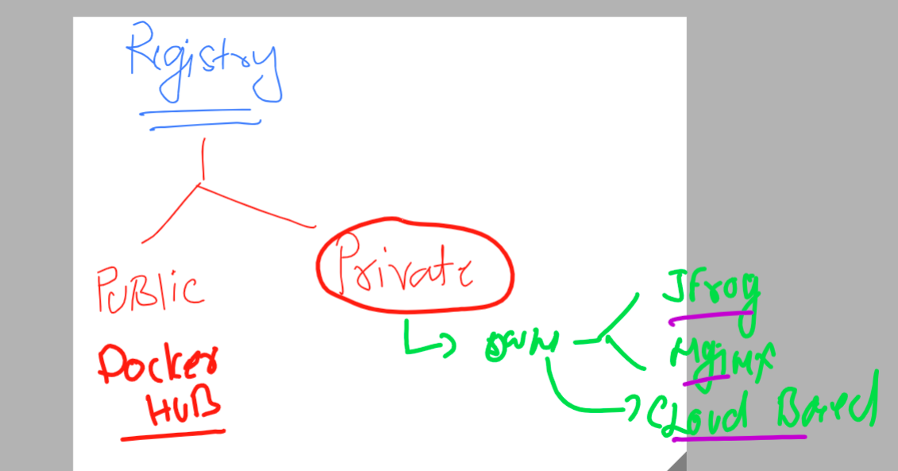
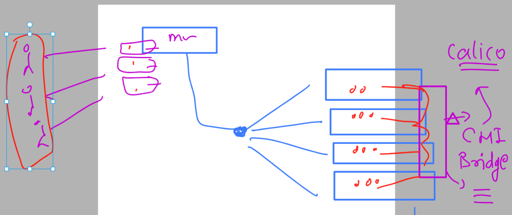
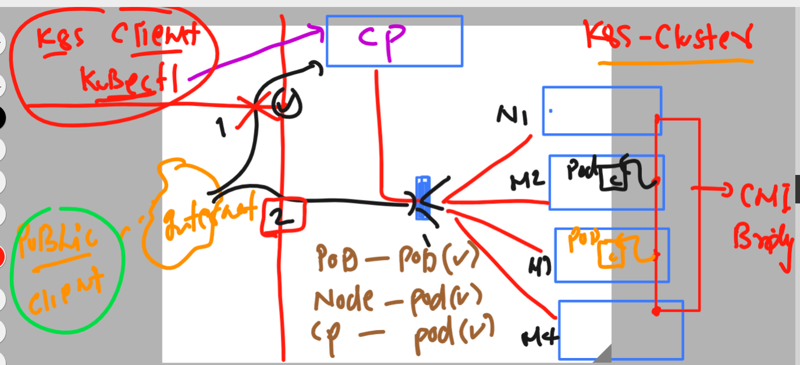
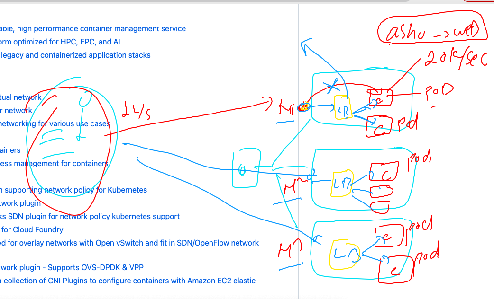
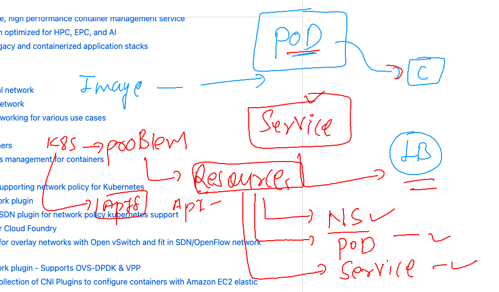

# k8s-cloud4c-b1

### More info about COntainer registry 



### checking current namespace

```
[ec2-user@ip-172-31-35-0 ashu-codes]$ kubectl config  get-contexts
CURRENT   NAME                          CLUSTER      AUTHINFO           NAMESPACE
*         kubernetes-admin@kubernetes   kubernetes   kubernetes-admin   ashu-app
[ec2-user@ip-172-31-35-0 ashu-codes]$ 
```

## Revising cni connection 



### creating yaml of pod 

```
[ec2-user@ip-172-31-35-0 ashu-codes]$ cd k8s-app-deployment/
[ec2-user@ip-172-31-35-0 k8s-app-deployment]$ ls
ashupod_auto.yaml  ashupod.json  ashu-webapp-pod.yaml  logs.txt  task1.yaml
[ec2-user@ip-172-31-35-0 k8s-app-deployment]$ 
[ec2-user@ip-172-31-35-0 k8s-app-deployment]$ 
[ec2-user@ip-172-31-35-0 k8s-app-deployment]$ kubectl  run ashu-ui --image=nginx --port 80 --dry-run=client -o yaml  >uipod.yaml 
[ec2-user@ip-172-31-35-0 k8s-app-deployment]$ 

```

### deploy pod yaml 
```
[ec2-user@ip-172-31-35-0 k8s-app-deployment]$ kubectl create -f  uipod.yaml 
pod/ashu-ui created
[ec2-user@ip-172-31-35-0 k8s-app-deployment]$ kubectl  get pods
NAME      READY   STATUS              RESTARTS   AGE
ashu-ui   0/1     ContainerCreating   0          3s
[ec2-user@ip-172-31-35-0 k8s-app-deployment]$ kubectl  get pods
NAME      READY   STATUS    RESTARTS   AGE
ashu-ui   1/1     Running   0          13s
[ec2-user@ip-172-31-35-0 k8s-app-deployment]$ kubectl  get pods -o wide
NAME      READY   STATUS    RESTARTS   AGE   IP                NODE                                          NOMINATED NODE   READINESS GATES
ashu-ui   1/1     Running   0          17s   192.168.246.161   ip-172-31-4-184.ap-south-1.compute.internal   <none>           <none>
[ec2-user@ip-172-31-35-0 k8s-app-deployment]$ 
```

### Traffic distribution from public internet will be going to workers



### we need Load balancer inside Nodes to distribute traffic to the pods of same application 



### Understanding api resources in k8s 



### checking current k8s version and its all api-resources

### checking version 

```
[ec2-user@ip-172-31-35-0 k8s-app-deployment]$ kubectl  version -o yaml 
clientVersion:
  buildDate: "2023-05-17T14:20:07Z"
  compiler: gc
  gitCommit: 7f6f68fdabc4df88cfea2dcf9a19b2b830f1e647
  gitTreeState: clean
  gitVersion: v1.27.2
  goVersion: go1.20.4
  major: "1"
  minor: "27"
  platform: linux/amd64
kustomizeVersion: v5.0.1
serverVersion:
  buildDate: "2023-05-17T14:08:49Z"
  compiler: gc
  gitCommit: 890a139214b4de1f01543d15003b5bda71aae9c7
  gitTreeState: clean
  gitVersion: v1.26.5
  goVersion: go1.19.9
  major: "1"
  minor: "26"
  platform: linux/amd64
```

### checking api-resources in this version 

```
[ec2-user@ip-172-31-35-0 k8s-app-deployment]$ kubectl  api-resources 
NAME                              SHORTNAMES   APIVERSION                             NAMESPACED   KIND
bindings                                       v1                                     true         Binding
componentstatuses                 cs           v1                                     false        ComponentStatus
configmaps                        cm           v1                                     true         ConfigMap
endpoints                         ep           v1                                     true         Endpoints
events                            ev           v1                                     true         Event
limitranges                       limits       v1                                     true         LimitRange
namespaces                        ns           v1                                     false        Namespace
nodes                             no           v1                                     false        Node
persistentvolumeclaims            pvc          v1                                     true         PersistentVolumeClaim
persistentvolumes                 pv           v1                                     false        PersistentVolume
pods                              po           v1                                     true         Pod
podtemplates                                   v1                                     true         PodTemplate
replicationcontrollers            rc           v1                                     true         ReplicationController
resourcequotas                    quota        v1                                     true         ResourceQuota
secrets                                        v1                                     true         Secret
serviceaccounts                   sa           v1                                     true         ServiceAccount
services                          svc          v1                                     true         Service
```
