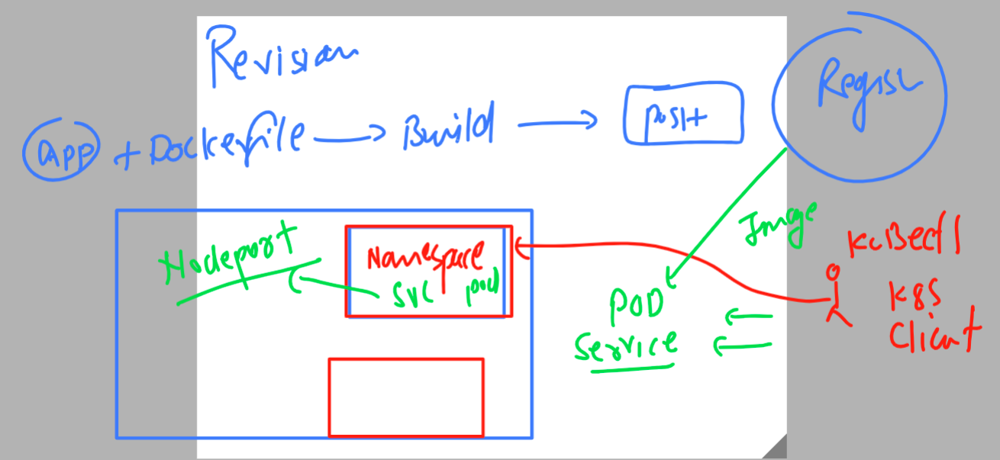

# k8s-cloud4c-b1

### Revision 



### creating yaml file of pod 

```
[ec2-user@ip-172-31-35-0 k8s-app-deployment]$ ls
ashupod_auto.yaml  ashu-webapp-pod.yaml  nodeport.yaml  uipod.yaml
ashupod.json       logs.txt              task1.yaml
[ec2-user@ip-172-31-35-0 k8s-app-deployment]$ kubectl  run  ashu-webapp2  --image=dockerashu/ashu-customer:v1   --port 80  --dry-run=client -o yaml  >webapp2.yaml 
[ec2-user@ip-172-31-35-0 k8s-app-deployment]$ ls
ashupod_auto.yaml  ashupod.json  ashu-webapp-pod.yaml  logs.txt  nodeport.yaml  task1.yaml  uipod.yaml  webapp2.yaml
[ec2-user@ip-172-31-35-0 k8s-app-deployment]$ 

```

### updating yaml with ENV 

```
apiVersion: v1
kind: Pod
metadata:
  creationTimestamp: null
  labels:
    run: ashu-webapp2
  name: ashu-webapp2 # name of pod 
spec:
  containers:
  - image: dockerashu/ashu-customer:v1 # docker image 
    name: ashu-webapp2 # name of container 
    ports:
    - containerPort: 80
    resources: {}
    env: # to create of update env variables
    - name: deploy # name of predefine variable 
      value: world # value of variable 
  dnsPolicy: ClusterFirst
  restartPolicy: Always
status: {}

```

### lets create it 

```
[ec2-user@ip-172-31-35-0 k8s-app-deployment]$ kubectl  create -f  webapp2.yaml 
pod/ashu-webapp2 created
[ec2-user@ip-172-31-35-0 k8s-app-deployment]$ kubectl  get  pods
NAME           READY   STATUS    RESTARTS   AGE
ashu-webapp2   1/1     Running   0          4s
[ec2-user@ip-172-31-35-0 k8s-app-deployment]$ kubectl  get  pods -o wide
NAME           READY   STATUS    RESTARTS   AGE   IP                NODE                                          NOMINATED NODE   READINESS GATES
ashu-webapp2   1/1     Running   0          8s    192.168.246.175   ip-172-31-4-184.ap-south-1.compute.internal   <none>           <none>
```

### creating nodeport service 

```
[ec2-user@ip-172-31-35-0 k8s-app-deployment]$ kubectl   expose   pod ashu-webapp2  --type NodePort --port 80 --name mylb1 --dry-run=client -o yaml >nodeport1.yaml 
[ec2-user@ip-172-31-35-0 k8s-app-deployment]$ kubectl  create -f nodeport1.yaml 
service/mylb1 created
[ec2-user@ip-172-31-35-0 k8s-app-deployment]$ kubectl  get  svc
NAME    TYPE       CLUSTER-IP       EXTERNAL-IP   PORT(S)        AGE
mylb1   NodePort   10.110.113.207   <none>        80:30499/TCP   4s
[ec2-user@ip-172-31-35-0 k8s-app-deployment]$ 
```


