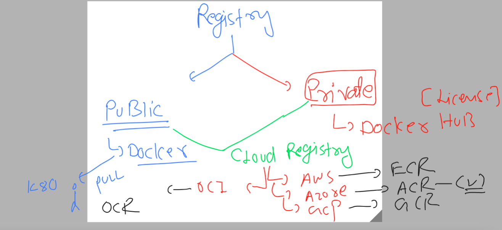
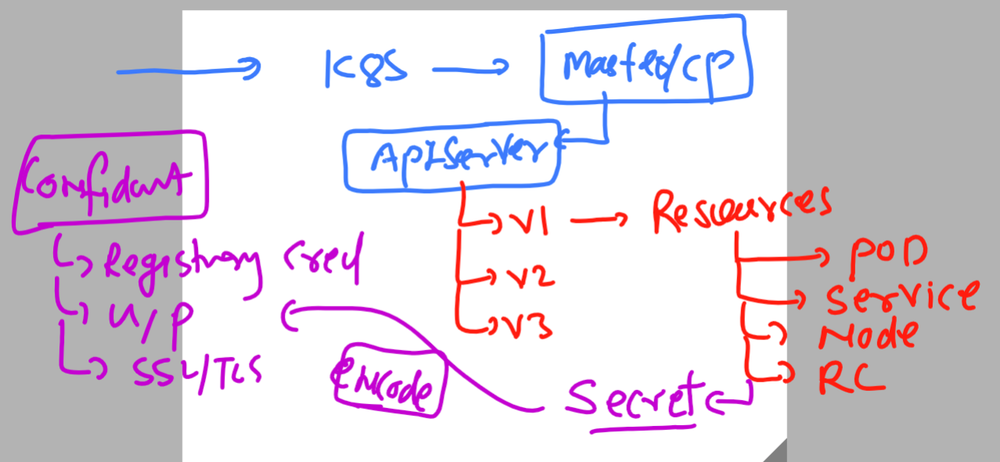

# k8s-cloud4c-b1
### cleaning up namespace 

```
[ec2-user@ip-172-31-35-0 ashu-codes]$ kubectl config get-contexts 
CURRENT   NAME                          CLUSTER      AUTHINFO           NAMESPACE
*         kubernetes-admin@kubernetes   kubernetes   kubernetes-admin   ashu-app
[ec2-user@ip-172-31-35-0 ashu-codes]$ kubectl   get  all
No resources found in ashu-app namespace.
[ec2-user@ip-172-31-35-0 ashu-codes]$ kubectl  delete all --all
No resources found
[ec2-user@ip-172-31-35-0 ashu-codes]$ 

```

### last day task removal 

```
[ec2-user@ip-172-31-35-0 ashu-codes]$ cd  k8s-app-deployment/
[ec2-user@ip-172-31-35-0 k8s-app-deployment]$ ls
ashupod_auto.yaml  ashu-rc.yaml          logs.txt     nodeport1.yaml  svcbyrc.yaml  uipod.yaml
ashupod.json       ashu-webapp-pod.yaml  mytask.yaml  nodeport.yaml   task1.yaml    webapp2.yaml
[ec2-user@ip-172-31-35-0 k8s-app-deployment]$ kubectl  delete -f  mytask.yaml --force
Warning: Immediate deletion does not wait for confirmation that the running resource has been terminated. The resource may continue to run on the cluster indefinitely.
namespace "ashuk8s1" force deleted
pod "ashupod1" force deleted
```

### Introduction cloud container registry to store your private images 

```
[ec2-user@ip-172-31-35-0 ashu-codes]$ cd  k8s-app-deployment/
[ec2-user@ip-172-31-35-0 k8s-app-deployment]$ ls
ashupod_auto.yaml  ashu-rc.yaml          logs.txt     nodeport1.yaml  svcbyrc.yaml  uipod.yaml
ashupod.json       ashu-webapp-pod.yaml  mytask.yaml  nodeport.yaml   task1.yaml    webapp2.yaml
[ec2-user@ip-172-31-35-0 k8s-app-deployment]$ kubectl  delete -f  mytask.yaml --force
Warning: Immediate deletion does not wait for confirmation that the running resource has been terminated. The resource may continue to run on the cluster indefinitely.
namespace "ashuk8s1" force deleted
pod "ashupod1" force deleted
```

## pushing image to azure cloud registry 



```
[ec2-user@ip-172-31-35-0 k8s-app-deployment]$ docker  tag   ashuwebsite:v1   ashutoshh.azurecr.io/ashutoshh/ashuwebsite:v1
```

### login

```
[ec2-user@ip-172-31-35-0 k8s-app-deployment]$ docker login  ashutoshh.azurecr.io 
Username: ashutoshh
Password: 
WARNING! Your password will be stored unencrypted in /home/ec2-user/.docker/config.json.
Configure a credential helper to remove this warning. See
https://docs.docker.com/engine/reference/commandline/login/#credentials-store

Login Succeeded
```

### pushing it 

```
[ec2-user@ip-172-31-35-0 k8s-app-deployment]$ docker push  ashutoshh.azurecr.io/ashutoshh/ashuwebsite:v1
The push refers to repository [ashutoshh.azurecr.io/ashutoshh/ashuwebsite]
b72bc389d5f1: Pushed 
4d33db9fdf22: Pushed 
6791458b3942: Pushed 
2731b5cfb616: Pushed 
043198f57be0: Pushed 
5dd6bfd241b4: Pushed 
8cbe4b54fa88: Pushed 
v1: digest: sha256:cb1a7b89e3625823b135e5f84ea54a3cf98f819f7f72b1bd75a3f6ab6ddd0164 size: 1780
[ec2-user@ip-172-31-35-0 k8s-app-deployment]$ docker logout ashutoshh.azurecr.io
Removing login credentials for ashutoshh.azurecr.io
[ec2-user@ip-172-31-35-0 k8s-app-deployment]$ 
```

### using above lets create pod 

```
 kubectl  run  ashu-secure-app --image=ashutoshh.azurecr.io/ashutoshh/ashuwebsite:v1  --port 80 --dry-run=client -o yaml  >cloudapp_pod.yaml
```

### we have got error image pull so lets check evets 

```
[ec2-user@ip-172-31-35-0 k8s-app-deployment]$ kubectl  get  events
LAST SEEN   TYPE      REASON      OBJECT                MESSAGE
3m14s       Normal    Scheduled   pod/ashu-secure-app   Successfully assigned ashu-app/ashu-secure-app to ip-172-31-4-184.ap-south-1.compute.internal
97s         Normal    Pulling     pod/ashu-secure-app   Pulling image "ashutoshh.azurecr.io/ashutoshh/ashuwebsite:v1"
97s         Warning   Failed      pod/ashu-secure-app   Failed to pull image "ashutoshh.azurecr.io/ashutoshh/ashuwebsite:v1": rpc error: code = Unknown desc = failed to pull and unpack image "ashutoshh.azurecr.io/ashutoshh/ashuwebsite:v1": failed to resolve reference "ashutoshh.azurecr.io/ashutoshh/ashuwebsite:v1": failed to authorize: failed to fetch anonymous token: unexpected status: 401 Unauthorized
97s         Warning   Failed      pod/ashu-secure-app   Error: ErrImagePull
85s         Normal    BackOff     pod/ashu-secure-app   Back-off pulling image "ashutoshh.azurecr.io/ashutoshh/ashuwebsite:v1"
111s        Warning   Failed      pod/ashu-secure-app   Error: ImagePullBackOff
[ec2-user@ip-172-31-35-0 k8s-app-deployment]$ kubectl  get  events  |  grep -i fail
2m9s        Warning   Failed      pod/ashu-secure-app   Failed to pull image "ashutoshh.azurecr.io/ashutoshh/ashuwebsite:v1": rpc error: code = Unknown desc = failed to pull and unpack image "ashutoshh.azurecr.io/ashutoshh/ashuwebsite:v1": failed to resolve reference "ashutoshh.azurecr.io/ashutoshh/ashuwebsite:v1": failed to authorize: failed to fetch anonymous token: unexpected status: 401 Unauthorized
2m9s        Warning   Failed      pod/ashu-secure-app   Error: ErrImagePull
2m23s       Warning   Failed      pod/ashu-secure-app   Error: ImagePullBackOff
[ec2-user@ip-172-31-35-0 k8s-app-deployment]$ 
```

### Introduction secret under apiversion v1 -- to store confidential information 



### generating secret yaml 

```
kubectl   create  secret   docker-registry  ashu-reg-secret  --docker-server=ashutoshh.azurecr.io  --docker-username="zz" --docker-password="xV" --dry-run=client -o yaml  >azure_secret.yam
```

### creating secret 

```
[ec2-user@ip-172-31-35-0 k8s-app-deployment]$ kubectl  create -f azure_secret.yaml 
secret/ashu-reg-secret created
[ec2-user@ip-172-31-35-0 k8s-app-deployment]$ kubectl  get  secrets
NAME              TYPE                             DATA   AGE
ashu-reg-secret   kubernetes.io/dockerconfigjson   1      8s
[ec2-user@ip-172-31-35-0 k8s-app-deployment]$ 
```
### calling secret in POd yaml 

```
apiVersion: v1
kind: Pod
metadata:
  creationTimestamp: null
  labels:
    run: ashu-secure-app
  name: ashu-secure-app # name of pod 
spec:
  imagePullSecrets: # calling secret 
  - name: ashu-reg-secret # name of secret 
  containers:
  - image: ashutoshh.azurecr.io/ashutoshh/ashuwebsite:v1
    name: ashu-secure-app
    ports:
    - containerPort: 80
    resources: {}
  dnsPolicy: ClusterFirst
  restartPolicy: Always
status: {}

```

### lets deploy it 

```
[ec2-user@ip-172-31-35-0 k8s-app-deployment]$ kubectl  get  po 
NAME              READY   STATUS             RESTARTS   AGE
ashu-secure-app   0/1     ImagePullBackOff   0          27m
[ec2-user@ip-172-31-35-0 k8s-app-deployment]$ kubectl  replace -f  cloudapp_pod.yaml  --force 
pod "ashu-secure-app" deleted
pod/ashu-secure-app replaced
[ec2-user@ip-172-31-35-0 k8s-app-deployment]$ kubectl   get  pods
NAME              READY   STATUS    RESTARTS   AGE
ashu-secure-app   1/1     Running   0          12s
[ec2-user@ip-172-31-35-0 k8s-app-deployment]$ kubectl   get  pods -o wide
NAME              READY   STATUS    RESTARTS   AGE   IP                NODE                                          NOMINATED NODE   READINESS GATES
ashu-secure-app   1/1     Running   0          21s   192.168.246.148   ip-172-31-4-184.ap-south-1.compute.internal   <none>           <none>
[ec2-user@ip-172-31-35-0 k8s-app-deployment]$ 

```

